# 2. Analysis: 영남대 공지 AI 큐레이션 시스템

**학번:** 22420490  
**이름:** 김혜민  

**Project Name:** Yu-Notion-Curation / Y-Curation
**Log in/App Icon:**

---

### [ Revision history ]

| Revision date | Version # | Description | Author |
| :--- | :--- | :--- | :--- |
| 2026/05/08 | 1.00 | Analysis Phase 초안 작성 | 김혜민 |

---

### = Contents =
1. Introduction
2. Use case analysis
3. Domain analysis
4. User Interface prototype
5. Glossary
6. References

---

## 1. Introduction

### 1.1 Executive Summary
본 보고서는 '영남대 공지 AI 큐레이션 시스템' 개발을 위한 분석 단계(Analysis Phase)의 최종 결과물이다. 이전 단계인 개념화(Conceptualization) 문서를 바탕으로, 시스템의 논리적 구조와 동작 방식을 구체화하는 데 목적이 있다. 본 문서에서는 액터와 유스케이스 간의 관계를 정의하고, 실제 사용자 인터페이스가 어떻게 구현될지 프로토타입을 통해 제시한다.

### 1.2 Project Features & Significance
본 프로젝트는 기존의 수동적인 공지 확인 방식이 가진 한계를 극복하기 위해 다음과 같은 가치를 지향한다.

* **유용성 (Usefulness):** 영남대학교의 여러 게시판에 흩어진 공지사항을 통합 수집하고, LLM을 활용해 방대한 텍스트를 3줄로 요약 제공함으로써 학생들의 정보 습득 효율을 극대화한다.
* **중요성 (Significance):** 장학금, 학사일정 등 기한이 중요한 정보를 실시간 키워드 매칭 알림으로 전달하여 학생들이 중요한 기회를 놓치는 일을 방지한다.
* **확장성 (Expandability):** 단순 공지 전달을 넘어, 향후 학생 개인의 전공이나 관심사에 맞춘 맞춤형 교과/비교과 로드맵 추천 시스템으로 발전할 수 있는 유연한 데이터 분석 구조를 갖춘다.

---

## 2. Use case analysis

### 2.1 Use Case Diagram
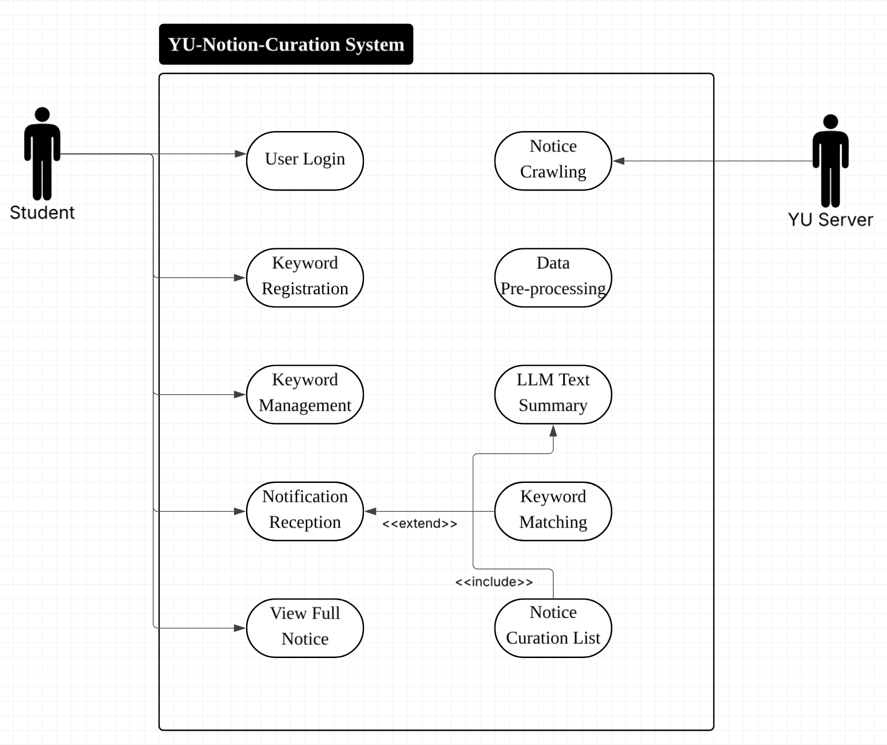

### 2.2 Use Case Description

#### [ Use Case List ]
아래는 본 시스템의 주요 기능을 정의한 Use Case 목록이다.

| Use Case Name | Use Case ID | Korean Name | Actor |
| :--- | :--- | :--- | :--- |
| **Log-in** | #1 | 로그인 | Student |
| **Register keyword** | #2 | 키워드 등록 | Student |
| **Manage keyword** | #3 | 키워드 관리 | Student |
| **Crawl notices** | #4 | 공지 크롤링 | YU Server |
| **Pre-process data** | #5 | 데이터 전처리 | System |
| **Summarize text** | #6 | LLM 텍스트 요약 | System |
| **Match keyword** | #7 | 키워드 매칭 | System |
| **Receive notification** | #8 | 알림 수신 | Student |
| **Inquiry curated list** | #9 | 큐레이션 목록 조회 | Student |
| **View full notice** | #10 | 원문 보기 | Student |

---

#### Use Case #1 : Log-in

##### GENERAL CHARACTERISTICS
| Item | Description |
| :--- | :--- |
| **Summary** | 등록된 학생이 학번과 비밀번호를 사용하여 시스템에 접속한다. |
| **Scope** | YU-Notion-Curation System |
| **Level** | User level |
| **Author** | 김혜민 |
| **Last Update** | May. 8. 2026 |
| **Status** | Under Review |
| **Primary Actor** | Student |
| **Secondary Actors** | Authentication Server |
| **Preconditions** | 학생이 시스템에 계정을 가지고 있어야 함. |
| **Trigger** | 로그인 화면에서 ID와 Password를 입력하고 로그인 버튼을 눌렀을 때. |
| **Success Post Condition** | 사용자 인증 완료 후 메인 화면으로 이동한다. |
| **Failed Post condition** | 로그인 정보가 불일치하여 접근이 거부된다. |

##### MAIN SUCCESS SCENARIO
| Step | Action |
| :--- | :--- |
| 1 | 사용자가 로그인 화면에서 학번과 비밀번호를 입력한다. |
| 2 | 인증 서버에서 입력된 정보의 유효성을 검사한다. |
| 3 | 정보가 일치하면 사용자 세션을 생성하고 대시보드를 출력한다. |

##### EXTENSION SCENARIOS
| Step | Branching Action |
| :--- | :--- |
| 2 | 2a. 학번이 존재하지 않거나 비밀번호가 틀린 경우. |
| | 2a1. 오류 메시지를 출력하고 입력창을 초기화한다. |

#### Use Case #2 : Register keyword

##### GENERAL CHARACTERISTICS
| Item | Description |
| :--- | :--- |
| **Summary** | 사용자가 관심 있는 특정 단어(예: 장학, 공모전)를 시스템에 등록하여 맞춤형 알림을 설정한다. |
| **Scope** | YU-Notion-Curation System |
| **Level** | User level |
| **Author** | 김혜민 |
| **Last Update** | May. 8. 2026 |
| **Status** | Under Review |
| **Primary Actor** | Student |
| **Secondary Actors** | Database Server |
| **Preconditions** | 사용자가 로그인을 성공한 상태여야 함. |
| **Trigger** | 메인 화면 또는 설정 메뉴에서 키워드 추가 기능을 실행한 경우. |
| **Success Post Condition** | 입력한 키워드가 서버 DB에 저장되어 실시간 매칭 알림 대상이 됨. |
| **Failed Post condition** | 중복된 키워드이거나 서버 오류로 인해 저장이 되지 않은 경우. |

##### MAIN SUCCESS SCENARIO
| Step | Action |
| :--- | :--- |
| 1 | 사용자가 키워드 설정 화면에서 추가하고 싶은 키워드를 입력한다. |
| 2 | '등록' 버튼을 눌러 서버에 저장 요청을 보낸다. |
| 3 | 시스템은 키워드 중복 여부 및 데이터 형식을 검증한다. |
| 4 | 검증이 완료되면 서버 DB에 저장하고 갱신된 키워드 목록을 GUI에 출력한다. |

##### EXTENSION SCENARIOS
| Step | Branching Action |
| :--- | :--- |
| 3 | 3a. 이미 동일한 키워드가 등록되어 있는 경우. |
| | 3a1. "이미 존재하는 키워드입니다" 메시지를 띄우고 등록을 취소한다. |
| 4 | 4b. 네트워크 장애로 인해 서버와 연결이 되지 않는 경우. |
| | 4b1. "네트워크 오류" 메시지를 출력하고 입력한 데이터를 임시 유지한다. |

##### RELATED INFORMATION
| Item | Description |
| :--- | :--- |
| **Performance** | ≦ 2 Second (등록 버튼 클릭 후 결과 피드백까지 시간) |
| **Frequency** | 필요 시 수시로 발생 |
| **Concurrency** | None |
| **Etc** | 최대 등록 가능 개수 초과 여부 확인 필요 |

#### Use Case #3 : Manage keyword

##### GENERAL CHARACTERISTICS
| Item | Description |
| :--- | :--- |
| **Summary** | 사용자가 현재 등록된 키워드 목록을 확인하고, 더 이상 필요 없는 키워드를 삭제하거나 수정하여 알림 설정을 최적화한다. |
| **Scope** | YU-Notion-Curation System |
| **Level** | User level |
| **Author** | 김혜민 |
| **Last Update** | May. 8. 2026 |
| **Status** | Under Review |
| **Primary Actor** | Student |
| **Secondary Actors** | Database Server |
| **Preconditions** | 사용자가 로그인을 성공한 상태이며, 최소 하나 이상의 키워드가 등록되어 있어야 함. |
| **Trigger** | 사용자가 '마이페이지' 또는 '키워드 관리' 메뉴를 선택한 경우. |
| **Success Post Condition** | 선택한 키워드가 삭제/수정되어 DB에 반영되고, 이후 알림 대상에서 제외/변경됨. |
| **Failed Post condition** | 서버 통신 문제로 데이터가 삭제되지 않거나 목록이 갱신되지 않은 경우. |

##### MAIN SUCCESS SCENARIO
| Step | Action |
| :--- | :--- |
| 1 | 사용자가 키워드 관리 화면을 요청하면 시스템이 DB에서 해당 사용자의 키워드 목록을 호출한다. |
| 2 | 시스템은 현재 등록된 키워드들을 리스트 형태로 GUI에 출력한다. |
| 3 | 사용자가 특정 키워드 옆의 '삭제' 버튼을 클릭한다. |
| 4 | 시스템은 사용자에게 정말 삭제할 것인지 확인 팝업을 띄운다. |
| 5 | 사용자가 확인을 누르면 시스템은 DB에서 해당 레코드를 삭제하고 목록을 새로고침한다. |

##### EXTENSION SCENARIOS
| Step | Branching Action |
| :--- | :--- |
| 1 | 1a. 등록된 키워드가 하나도 없는 경우. |
| | 1a1. 시스템은 "등록된 키워드가 없습니다"라는 안내 문구와 함께 키워드 등록 화면으로 유도한다. |
| 4 | 4a. 사용자가 삭제 확인 팝업에서 '취소'를 선택한 경우. |
| | 4a1. 삭제 프로세스를 즉시 중단하고 기존 목록 화면을 유지한다. |
| 5 | 5b. 삭제 도중 서버 연결이 끊긴 경우. |
| | 5b1. "삭제 실패: 네트워크 연결을 확인하세요" 메시지를 띄우고 목록 갱신을 보류한다. |

##### RELATED INFORMATION
| Item | Description |
| :--- | :--- |
| **Performance** | ≦ 1.5 Seconds (삭제 버튼 클릭 후 목록 갱신까지) |
| **Frequency** | 사용자의 알림 선호도가 바뀔 때마다 발생 |
| **Concurrency** | 실시간으로 알림 매칭 엔진이 돌고 있을 때 삭제할 경우, 즉시 매칭 대상에서 제외하는 동기화 로직 필요. |

---

#### Use Case #4 : Crawl notices

##### GENERAL CHARACTERISTICS
| Item | Description |
| :--- | :--- |
| **Summary** | 시스템이 주기적으로 영남대학교 공지사항 게시판에 접속하여 제목, 본문, 작성일, 첨부파일 유무 등 새로운 데이터를 수집한다. |
| **Scope** | YU-Notion-Curation System (Backend) |
| **Level** | Sub-function level |
| **Author** | 김혜민 |
| **Last Update** | May. 8. 2026 |
| **Status** | Under Review |
| **Primary Actor** | System |
| **Secondary Actors** | YU Server (External) |
| **Preconditions** | 시스템 서버가 가동 중이며 인터넷 네트워크가 연결되어 있어야 함. |
| **Trigger** | 설정된 스케줄러에 의한 주기적 실행(예: 30분 간격) 또는 관리자의 수동 실행. |
| **Success Post Condition** | 학교 홈페이지의 신규 공지가 누락 없이 시스템 내부 임시 저장소에 로드됨. |
| **Failed Post condition** | 학교 서버 차단, 레이아웃 변경 등으로 데이터를 읽어오지 못한 경우. |

##### MAIN SUCCESS SCENARIO
| Step | Action |
| :--- | :--- |
| 1 | 시스템 스케줄러가 크롤링 엔진을 가동시킨다. |
| 2 | 지정된 학교 홈페이지 게시판 URL로 HTTP 요청을 보낸다. |
| 3 | 응답받은 HTML 코드에서 최신 공지글 리스트를 파싱(Parsing)한다. |
| 4 | 기존에 저장된 데이터와 비교하여 '새로운 글'만 선별하여 원문 데이터를 추출한다. |

##### EXTENSION SCENARIOS
| Step | Branching Action |
| :--- | :--- |
| 2 | 2a. 학교 서버가 응답하지 않거나 점검 중인 경우(404, 500 에러). |
| | 2a1. 시스템은 크롤링을 중단하고 10분 뒤 재시도 스케줄을 잡으며 관리자에게 알림을 보낸다. |
| 3 | 3a. 학교 홈페이지의 HTML 태그 구조가 변경되어 파싱이 불가능한 경우. |
| | 3a1. 시스템은 예외 로그를 남기고, 분석 중단 후 관리자에게 '스크레이퍼 수정 필요' 알림을 보낸다. |
| 4 | 4b. 중복 데이터만 있는 경우. |
| | 4b1. 새로 추가할 데이터가 없으므로 프로세스를 조기 종료한다. |

##### RELATED INFORMATION
| Item | Description |
| :--- | :--- |
| **Performance** | 페이지당 ≦ 10 Seconds 이내 (서버 부하 방지를 위해 지연 시간 포함) |
| **Frequency** | 24시간 상시 가동 (30분~1시간 주기가 적당) |
| **Concurrency** | 여러 게시판(장학, 학사, 취업)을 멀티스레드로 동시 크롤링할 수 있음. |
| **Etc** | 학교 서버로부터 IP 차단(Ban)을 당하지 않도록 User-Agent 설정 필수. |

#### Use Case #5 : Pre-process data

##### GENERAL CHARACTERISTICS
| Item | Description |
| :--- | :--- |
| **Summary** | 수집된 HTML 형태의 원문 데이터에서 불필요한 태그, 광고, 스크립트를 제거하고 LLM이 분석하기 좋은 순수 텍스트 형태로 정제한다. |
| **Scope** | YU-Notion-Curation System (Data Engine) |
| **Level** | Sub-function level |
| **Author** | 김혜민 |
| **Last Update** | May. 8. 2026 |
| **Status** | Under Review |
| **Primary Actor** | System |
| **Secondary Actors** | Database Server |
| **Preconditions** | [UC-04]를 통해 수집된 원문 데이터가 임시 저장소에 존재해야 함. |
| **Trigger** | 크롤링 프로세스가 종료되어 새로운 원문 데이터가 입고된 경우. |
| **Success Post Condition** | 정제된 텍스트 데이터가 생성되어 요약 엔진([UC-06])으로 전달될 준비가 됨. |
| **Failed Post condition** | 데이터 정제 과정에서 핵심 내용이 유실되거나 인코딩 오류가 발생한 경우. |

##### MAIN SUCCESS SCENARIO
| Step | Action |
| :--- | :--- |
| 1 | 시스템이 임시 저장된 공지사항 원문을 불러온다. |
| 2 | HTML 파서를 사용하여 텍스트 본문 영역을 추출하고 광고나 불필요한 공백을 제거한다. |
| 3 | 텍스트 인코딩(UTF-8 등)을 통일하고 특수문자를 일반 텍스트로 치환한다. |
| 4 | 정제된 텍스트를 분석용 DB에 저장한다. |

##### EXTENSION SCENARIOS
| Step | Branching Action |
| :--- | :--- |
| 2 | 2a. 본문 내용이 너무 짧거나(예: 10자 미만) 본문 영역을 찾을 수 없는 경우. |
| | 2a1. 해당 공지를 '에러 데이터'로 분류하고 정제 프로세스를 중단한 뒤 원문 링크만 보존한다. |
| 3 | 3a. 인코딩이 깨져 텍스트를 읽을 수 없는 경우. |
| | 3a1. 여러 인코딩 방식을 재시도해보고, 실패 시 관리자에게 복구 요청 알림을 보낸다. |

##### RELATED INFORMATION
| Item | Description |
| :--- | :--- |
| **Performance** | 건당 ≦ 0.5 Seconds |
| **Frequency** | 수집된 데이터 개수만큼 반복 실행 |

---

#### Use Case #6 : Summarize text

##### GENERAL CHARACTERISTICS
| Item | Description |
| :--- | :--- |
| **Summary** | 정제된 공지사항 본문을 LLM(Large Language Model)에 전달하여 사용자가 가독성 있게 읽을 수 있는 3줄 핵심 요약본을 생성한다. |
| **Scope** | YU-Notion-Curation System (AI Engine) |
| **Level** | Sub-function level |
| **Author** | 김혜민 |
| **Last Update** | May. 8. 2026 |
| **Status** | Under Review |
| **Primary Actor** | System |
| **Secondary Actors** | LLM API Server (OpenAI, Gemini 등) |
| **Preconditions** | [UC-05]를 통해 정제된 텍스트 데이터가 준비되어 있어야 함. |
| **Trigger** | 데이터 전처리가 완료된 신규 공지가 DB에 등록된 경우. |
| **Success Post Condition** | 공지사항의 핵심 의미가 담긴 3줄 요약 텍스트가 DB에 최종 저장됨. |
| **Failed Post condition** | API 할당량 초과, 네트워크 장애 등으로 요약본을 생성하지 못한 경우. |

##### MAIN SUCCESS SCENARIO
| Step | Action |
| :--- | :--- |
| 1 | 시스템이 정제된 텍스트와 함께 요약 규칙(Prompt)을 포함하여 LLM API를 호출한다. |
| 2 | LLM으로부터 생성된 요약 결과(JSON 또는 String)를 수신한다. |
| 3 | 수신된 데이터에서 3줄 요약 문구만 추출하여 해당 공지의 요약 필드에 저장한다. |

##### EXTENSION SCENARIOS
| Step | Branching Action |
| :--- | :--- |
| 1 | 1a. API Key 오류 또는 할당량(Quota) 초과가 발생한 경우. |
| | 1a1. 즉시 작업을 중단하고 관리자에게 긴급 알림을 보낸 후, 기존 텍스트를 앞부분만 잘라 대체 요약으로 사용한다. |
| 2 | 2a. LLM이 생성한 결과값이 규칙(3줄 제한 등)을 어기거나 비어있는 경우. |
| | 2a1. 최대 2회까지 재요청을 시도하고, 지속적으로 실패 시 오류 로그를 남긴다. |

##### RELATED INFORMATION
| Item | Description |
| :--- | :--- |
| **Performance** | 건당 ≦ 3~7 Seconds (API 응답 속도에 의존) |
| **Frequency** | 모든 신규 공지에 대해 실행 |
| **Etc** | 요약 결과물에 대한 품질 검증(할루시네이션 방지) 로직 고려 필요. |

---

#### Use Case #7 : Match keyword

##### GENERAL CHARACTERISTICS
| Item | Description |
| :--- | :--- |
| **Summary** | 생성된 요약문 및 제목과 사용자들이 등록한 키워드 DB를 대조하여 알림을 보낼 대상자를 추출한다. |
| **Scope** | YU-Notion-Curation System (Matching Engine) |
| **Level** | Sub-function level |
| **Author** | 김혜민 |
| **Last Update** | May. 8. 2026 |
| **Status** | Under Review |
| **Primary Actor** | System |
| **Secondary Actors** | Database Server |
| **Preconditions** | 신규 공지에 대한 요약 작업([UC-06])이 완료되어야 함. |
| **Trigger** | 새로운 요약 데이터가 DB에 업데이트되는 즉시 실행. |
| **Success Post Condition** | 키워드가 일치하는 사용자 목록이 생성되어 알림 큐(Queue)로 전달됨. |
| **Failed Post condition** | 키워드 대조 과정에서 논리적 오류가 발생하거나 매칭 대상을 누락한 경우. |

##### MAIN SUCCESS SCENARIO
| Step | Action |
| :--- | :--- |
| 1 | 시스템이 새로 저장된 공지의 제목과 요약 텍스트를 불러온다. |
| 2 | 전체 사용자의 키워드 목록과 공지 텍스트를 텍스트 매칭 알고리즘으로 비교한다. |
| 3 | 키워드가 포함된 공지를 발견하면 해당 사용자의 ID와 공지 ID를 매칭 테이블에 기록한다. |
| 4 | 매칭된 데이터들을 알림 전송 모듈([UC-08])로 넘긴다. |

##### EXTENSION SCENARIOS
| Step | Branching Action |
| :--- | :--- |
| 2 | 2a. 키워드가 '장학'인데 공지에 '장학금'이 있는 경우처럼 부분 일치 여부 판단이 필요한 경우. |
| | 2a1. 유연한 검색을 위해 정규표현식(Regex) 또는 형태소 분석기를 사용하여 매칭률을 높인다. |
| 3 | 3a. 매칭되는 사용자가 한 명도 없는 경우. |
| | 3a1. 알림 없이 프로세스를 조용히 종료한다. |

##### RELATED INFORMATION
| Item | Description |
| :--- | :--- |
| **Performance** | ≦ 1 Second (사용자 수와 키워드 수에 비례) |
| **Concurrency** | 대규모 사용자를 고려하여 효율적인 DB 인덱싱 및 검색 알고리즘 필수. |

#### Use Case #8 : Receive notification

##### GENERAL CHARACTERISTICS
| Item | Description |
| :--- | :--- |
| **Summary** | 사용자가 등록한 키워드와 일치하는 공지가 발생했을 때, 해당 공지의 요약본과 원문 링크를 포함한 알림을 전송한다. |
| **Scope** | YU-Notion-Curation System (Notification) |
| **Level** | User level |
| **Author** | 김혜민 |
| **Last Update** | May. 8. 2026 |
| **Status** | Under Review |
| **Primary Actor** | Student |
| **Secondary Actors** | Messaging Server (Telegram API / FCM) |
| **Preconditions** | [UC-07]을 통해 특정 공지와 사용자 간의 매칭이 완료되어야 함. |
| **Trigger** | 키워드 매칭 엔진에서 전송 대상자 명단이 넘어온 경우. |
| **Success Post Condition** | 사용자가 자신의 모바일 기기나 PC를 통해 공지 요약 알림을 수신함. |
| **Failed Post condition** | 알림 서버 장애나 사용자 설정 문제로 메시지 전달이 실패한 경우. |

##### MAIN SUCCESS SCENARIO
| Step | Action |
| :--- | :--- |
| 1 | 시스템이 매칭된 사용자의 알림 수신 채널(텔레그램 ID 등) 정보를 DB에서 조회한다. |
| 2 | 공지 제목, 3줄 요약, 원문 URL을 포함한 메시지 객체를 생성한다. |
| 3 | 외부 메시징 서버 API를 호출하여 메시지 발송을 요청한다. |
| 4 | 발송 성공 여부를 확인하고 전송 로그를 기록한다. |

##### EXTENSION SCENARIOS
| Step | Branching Action |
| :--- | :--- |
| 1 | 1a. 사용자가 알림 수신을 일시적으로 꺼두거나 봇을 차단한 경우. |
| | 1a1. 전송 시도 후 오류 응답을 받으면 해당 사용자의 상태를 '수신 거부'로 업데이트하고 전송을 취소한다. |
| 3 | 3a. 외부 메시징 서버(Telegram 등) 자체의 일시적인 장애가 발생한 경우. |
| | 3a1. 메시지를 '전송 대기 큐'에 저장하고, 5분 간격으로 최대 3회 재시도한다. |

##### RELATED INFORMATION
| Item | Description |
| :--- | :--- |
| **Performance** | 매칭 후 ≦ 3 Seconds 이내 발송 완료 |
| **Frequency** | 키워드 매칭 발생 시마다 수시 발생 |
| **Concurrency** | 다수의 사용자에게 동시 발송 시 속도 제한(Rate Limit) 회피 로직 필요. |

---

#### Use Case #9 : Inquiry curated list

##### GENERAL CHARACTERISTICS
| Item | Description |
| :--- | :--- |
| **Summary** | 사용자가 시스템 대시보드에 접속하여 최신 공지사항들의 3줄 요약 목록을 카테고리별로 한눈에 조회한다. |
| **Scope** | YU-Notion-Curation System (Frontend) |
| **Level** | User level |
| **Author** | 김혜민 |
| **Last Update** | May. 8. 2026 |
| **Status** | Under Review |
| **Primary Actor** | Student |
| **Secondary Actors** | Database Server |
| **Preconditions** | 사용자가 로그인을 완료한 상태여야 함. |
| **Trigger** | 사용자가 시스템 메인 화면에 접속하거나 '큐레이션 목록' 메뉴를 클릭한 경우. |
| **Success Post Condition** | 최신 요약 데이터가 포함된 공지 리스트가 사용자 화면에 출력됨. |
| **Failed Post condition** | DB 조회 오류로 목록이 로드되지 않거나 데이터가 비어있는 경우. |

##### MAIN SUCCESS SCENARIO
| Step | Action |
| :--- | :--- |
| 1 | 사용자가 큐레이션 목록 화면을 요청한다. |
| 2 | 시스템은 DB에서 최신순/카테고리별로 정렬된 요약 데이터 목록을 호출한다. |
| 3 | 호출된 데이터를 리스트 형태의 GUI(카드 레이아웃 등)로 사용자에게 보여준다. |

##### EXTENSION SCENARIOS
| Step | Branching Action |
| :--- | :--- |
| 2 | 2a. 학교 게시판 점검 등으로 인해 최근 수집된 데이터가 하루 이상 없는 경우. |
| | 2a1. "최신 공지가 없습니다. 수집 중이니 잠시만 기다려주세요" 안내 문구를 노출한다. |
| 3 | 3a. 특정 카테고리(예: 장학)에 해당하는 공지만 필터링하고 싶은 경우. |
| | 3a1. 사용자가 필터를 선택하면 시스템은 해당 조건에 맞는 데이터만 다시 필터링하여 출력한다. |

##### RELATED INFORMATION
| Item | Description |
| :--- | :--- |
| **Performance** | ≦ 2 Seconds (화면 진입 후 로딩 완료까지) |
| **Frequency** | 서비스 접속 시마다 발생 |

---

#### Use Case #10 : View full notice

##### GENERAL CHARACTERISTICS
| Item | Description |
| :--- | :--- |
| **Summary** | 요약본을 확인한 사용자가 더 구체적인 내용을 알기 위해 원문 보기 버튼을 눌러 영남대 홈페이지 해당 게시글로 이동한다. |
| **Scope** | YU-Notion-Curation System |
| **Level** | User level |
| **Author** | 김혜민 |
| **Last Update** | May. 8. 2026 |
| **Status** | Under Review |
| **Primary Actor** | Student |
| **Secondary Actors** | YU Server (External Browser) |
| **Preconditions** | 사용자가 큐레이션 목록이나 알림 메시지에서 특정 공지를 선택해야 함. |
| **Trigger** | 요약 하단의 '원문 링크' 또는 '상세 보기' 버튼을 클릭한 경우. |
| **Success Post Condition** | 외부 브라우저가 실행되며 영남대 공식 홈페이지의 해당 공지 페이지가 열림. |
| **Failed Post condition** | 원문 링크가 만료되었거나 학교 서버의 공지글이 삭제된 경우. |

##### MAIN SUCCESS SCENARIO
| Step | Action |
| :--- | :--- |
| 1 | 사용자가 요약 정보 하단에 제공된 '원문 보기' 링크를 클릭한다. |
| 2 | 시스템은 해당 공지의 고유 URL(Original Link)을 호출한다. |
| 3 | 시스템은 사용자의 기본 브라우저를 통해 해당 URL로 리다이렉트(Redirect)한다. |

##### EXTENSION SCENARIOS
| Step | Branching Action |
| :--- | :--- |
| 3 | 3a. 원문 공지글이 삭제되어 '404 Not Found' 페이지가 나오는 경우. |
| | 3a1. 시스템은 브라우저 이동 전 링크 유효성을 체크(Head Request 등)하여, 삭제된 경우 "원본 글이 삭제되었습니다"라고 안내한다. |

##### RELATED INFORMATION
| Item | Description |
| :--- | :--- |
| **Performance** | ≦ 1 Second (클릭 후 브라우저 호출까지) |
| **Frequency** | 상세 내용 확인이 필요할 때마다 발생 |
| **Etc** | 모바일 환경의 경우 인앱 브라우저(In-app Browser) 활용 여부 검토 필요. |

## 3. Domain Analysis

본 섹션에서는 시스템이 다루는 핵심 도메인 개념들을 정의하고, 각 개념이 시스템 운영 프로세스 내에서 어떻게 상호작용하는지 분석한다.

### 3.1 Domain Concept Definitions (개념 정의)

1. **Student (사용자)**
   - 시스템의 최종 이용자로, 학번 기반의 인증을 거쳐 개인화된 알림 서비스를 제공받는 주체이다. 등록된 키워드에 따라 필터링된 공지 정보만을 소비한다.

2. **Curation Engine (큐레이션 엔진)**
   - 학교 서버로부터 원천 데이터를 수집(Crawling)하고, 전처리(Pre-processing) 과정을 거쳐 LLM을 통해 정보를 정제하는 시스템의 핵심 논리 계층이다.

3. **Notice & Summary (공지 및 요약)**
   - **Notice:** 학교 홈페이지에 게시된 가공되지 않은 원본 게시물 데이터이다.
   - **Summary:** 원본 데이터의 핵심 내용을 추출하여 3줄 이내로 요약한 가공 데이터이다.

4. **Keyword Matching (키워드 매칭)**
   - 사용자의 선호도(Keyword)와 요약된 정보(Summary) 간의 연관성을 계산하여 알림 발송 여부를 결정하는 논리적 연결 고리이다.

### 3.2 Object Interaction & Relationships (객체 간 상호작용)

도메인 객체들은 다음과 같은 논리적 흐름에 따라 상호작용하며 서비스를 완성한다.

* **[Data Flow]**: YU Server → **Notice** → **Curation Engine** → **Summary**
    - 외부 서버에서 수집된 원본 공지(Notice)는 시스템 내부의 엔진에 의해 분석하기 쉬운 형태의 요약본(Summary)으로 변환된다.
    
* **[Logic Flow]**: **Student** → **Keyword** ↔ **Summary** → **Notification**
    - 학생(Student)이 등록한 관심사(Keyword)는 생성된 요약본(Summary)과 실시간으로 대조(Matching)되며, 일치할 경우에만 알림(Notification)이 발생한다.

* **[Access Flow]**: **Student** → **Curation List** → **Original Notice URL**
    - 학생은 시스템이 제공하는 요약 목록을 통해 정보를 파악하며, 필요 시 제공된 URL을 통해 원문 공지에 접근한다.

### 3.3 Domain Constraints (도메인 제약 사항)

1. **Uniqueness**: 한 명의 학생은 시스템 내에서 고유한 학번으로 식별되어야 하며, 중복된 알림 채널 정보를 가질 수 없다.
2. **Integrity**: 모든 요약본(Summary)은 반드시 출처가 되는 원본 공지(Notice)의 링크를 포함해야 한다.
3. **Consistency**: 키워드 삭제 시 해당 키워드와 관련된 모든 매칭 대기 목록은 즉시 무효화되어야 한다.

## 4. User Interface Prototype

본 프로젝트의 인터페이스는 정보의 과부하를 방지하고, 학생들에게 꼭 필요한 공지만을 선별하여 전달하는 '큐레이션 경험'을 극대화하도록 설계되었다. 모든 UI는 모바일 반응형 웹(Responsive Web)을 기준으로 하며, 각 화면의 상세 명세는 다음과 같다.

---

### 4.1 UI Prototype Screens & Detailed Specifications

#### [Screen 01] 사용자 인증 및 진입 (Login Stage 1)
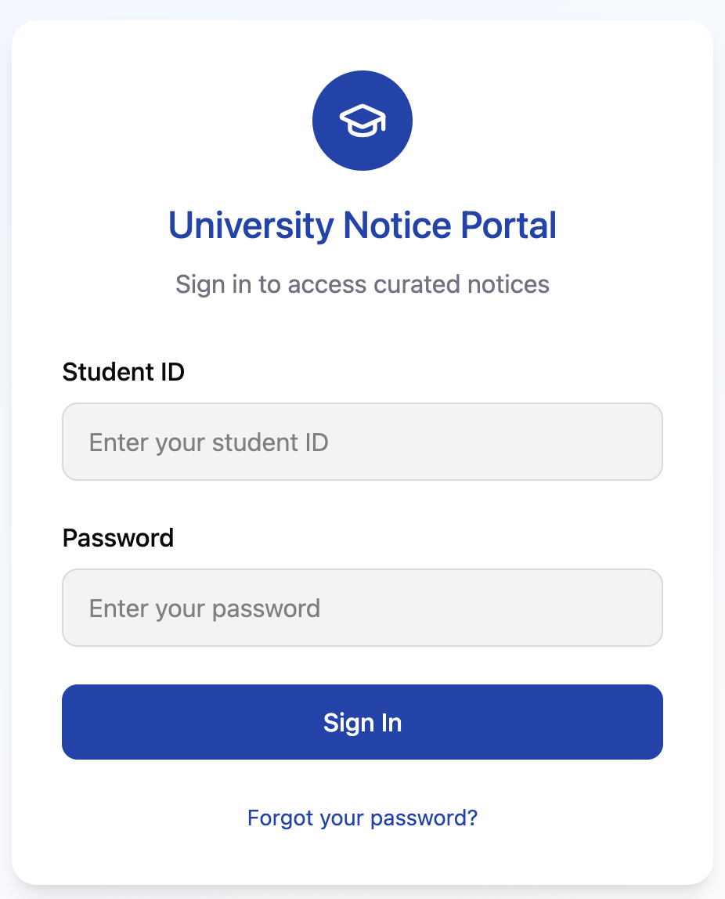
- **개요**: 시스템 접근 권한을 획득하기 위한 학번 기반의 인증 화면이다.
- **상세 설계**: 
    - 영남대학교 학번 표준 형식을 따르는 입력 폼을 제공한다.
    - 직관적인 'Sign In' 버튼을 통해 시스템의 개인화된 데이터베이스에 접근한다.
- **분석적 의도**: 유스케이스 `UC-01(Log-in)`을 구현하며, 사용자의 고유 식별자를 통해 개인별 키워드 매칭 테이블을 호출하는 시점이다.

#### [Screen 02] 확장된 인증 옵션 (Login Stage 2)
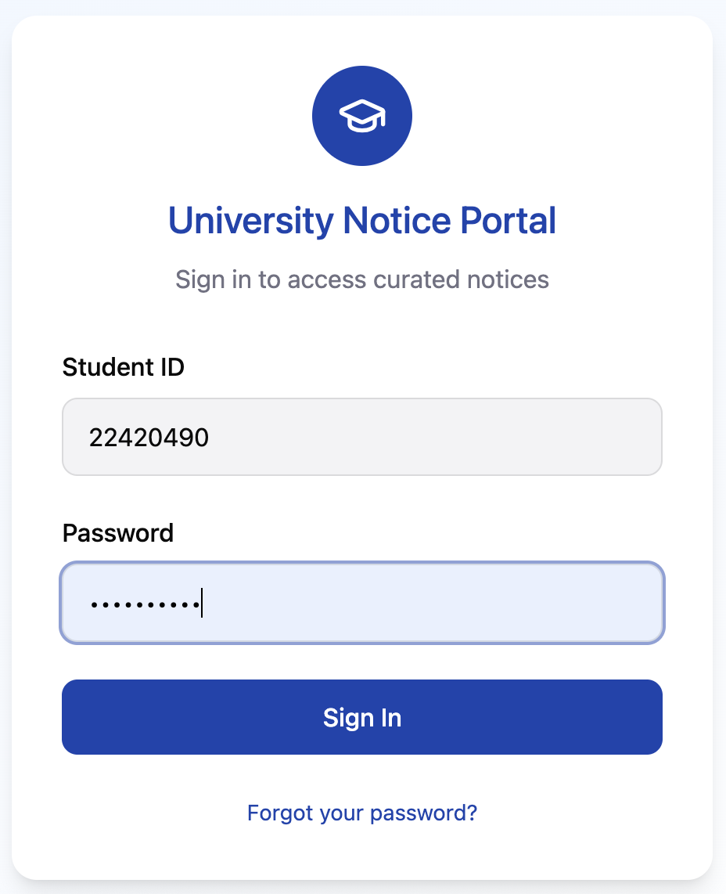
- **개요**: 접근성 향상을 위한 소셜 계정 연동 및 회원가입 보조 화면이다.
- **상세 설계**:
    - Google, Apple 등 외부 ID 연동을 통해 별도의 가입 절차를 간소화한다.
    - 하단의 'Create Account' 링크를 통해 신규 사용자의 유입 경로를 명확히 제시한다.
- **분석적 의도**: 사용자 편의성을 높여 서비스 이탈률을 줄이고, 알림 수신 채널(텔레그램 등)과의 연동을 준비하는 단계이다.

#### [Screen 03] 알림 카테고리 대분류 설정 (Keyword Grouping)
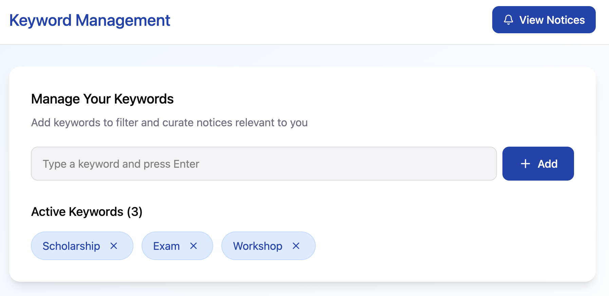
- **개요**: 수집되는 방대한 공지사항 중 사용자가 관심을 가질 법한 게시판 범위를 설정한다.
- **상세 설계**:
    - 장학, 학사, 취업, 행사 등 학교 게시판의 대분류를 토글 방식으로 선택한다.
- **분석적 의도**: 크롤링 엔진(`UC-04`)이 수집한 데이터 중 1차 필터링을 수행하여 시스템 부하를 줄이고 정확도를 높인다.

#### [Screen 04] 정밀 키워드 입력 인터페이스 (Keyword Input)
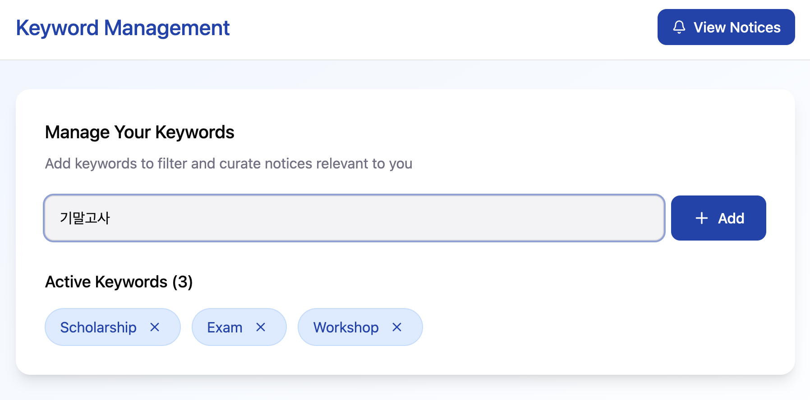
- **개요**: 카테고리 내에서 사용자가 타겟팅하는 세부 단어를 직접 입력하는 화면이다.
- **상세 설계**:
    - 'Add your keyword' 입력 필드를 통해 '성적장학', '해외파견' 등 구체적인 명사를 수집한다.
- **분석적 의도**: 유스케이스 `UC-02(Register keyword)`의 핵심 화면으로, 여기서 입력된 단어는 향후 AI 매칭 알고리즘의 핵심 가중치(Weight)가 된다.

#### [Screen 05] 등록 키워드 시각화 대시보드 (Keyword View)
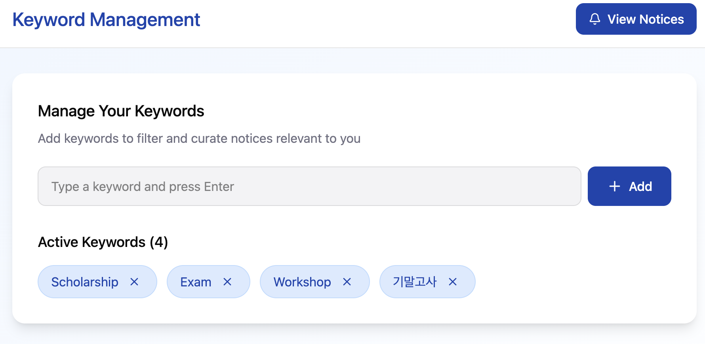
- **개요**: 현재 사용자가 설정하여 운영 중인 모든 키워드를 한눈에 확인하는 화면이다.
- **상세 설계**:
    - 등록된 각 키워드를 'Chip' 레이아웃으로 배치하여 가독성을 확보하였다.
- **분석적 의도**: 사용자가 자신이 어떤 정보에 노출되고 있는지 인지하게 함으로써, 개인화된 정보 큐레이션 상태를 투명하게 관리한다.

#### [Screen 06] 키워드 편집 및 데이터 정제 (Keyword Management)
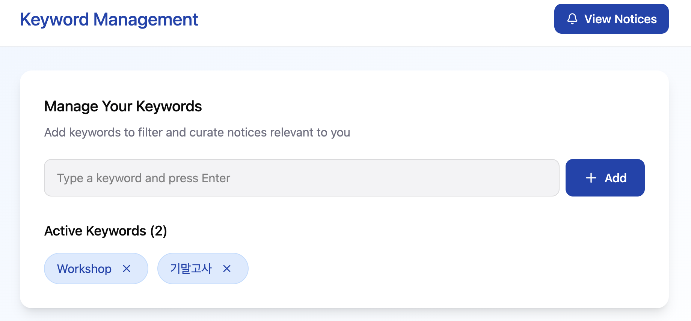
- **개요**: 더 이상 유효하지 않은 정보를 차단하기 위해 키워드를 삭제하거나 수정한다.
- **상세 설계**:
    - 각 키워드 우측의 삭제(X) 아이콘을 통해 즉각적인 데이터 제외가 가능하다.
- **분석적 의도**: 유스케이스 `UC-03(Manage keyword)`을 시각화한 것으로, 동적인 데이터 관리 환경을 제공하여 스팸성 알림을 방지한다.

#### [Screen 07] 맞춤형 공지 큐레이션 피드 (Search Feed)
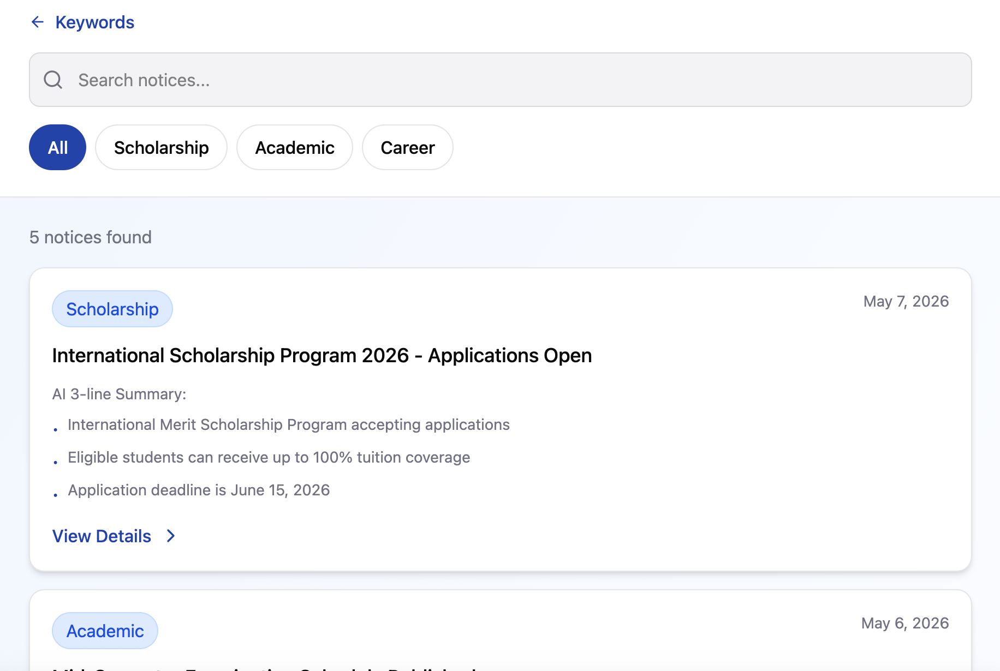
- **개요**: 키워드 매칭 엔진(`UC-07`)을 통해 선별된 공지사항이 나열되는 메인 화면이다.
- **상세 설계**:
    - 카드형 레이아웃을 통해 제목, 카테고리, 게시판 정보를 명확히 구분하여 노출한다.
- **분석적 의도**: 유스케이스 `UC-09(Inquiry curated list)`의 구현체이며, 사용자에게 최적화된 정보 우선순위를 부여하여 배치한다.

#### [Screen 08] LLM 기반 AI 3줄 요약 레이아웃 (AI Summary)
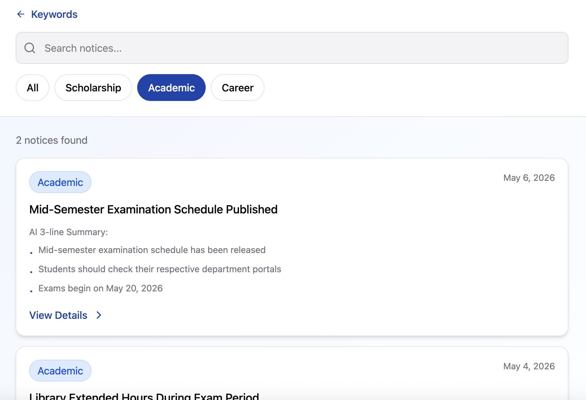
- **개요**: 공지 원문의 핵심 내용을 AI가 정제하여 보여주는 시스템의 정체성이 담긴 화면이다.
- **상세 설계**:
    - 텍스트 하단에 불릿 포인트 형태의 핵심 요약 정보를 배치하여 가독성을 극대화했다.
- **분석적 의도**: 유스케이스 `UC-06(Summarize text)`의 결과물을 사용자에게 전달하는 지점으로, 정보 탐색 시간을 획기적으로 단축한다.

#### [Screen 09] 통합 검색 및 확장 필터링 (Search Logic)
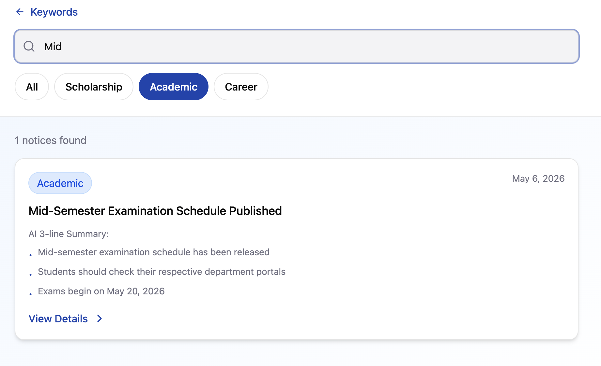
- **개요**: 키워드 자동 매칭 외에 사용자가 능동적으로 과거 데이터를 조회하는 검색 화면이다.
- **상세 설계**:
    - 검색어 입력 및 정렬 필터를 통해 수동으로 정보를 탐색할 수 있는 기능을 제공한다.
- **분석적 의도**: 자동화 시스템이 놓칠 수 있는 예외적인 정보 탐색 요구를 충족시키기 위한 보조 인터페이스이다.

#### [Screen 10] 원문 리다이렉트 및 최종 과업 완수 (Direct Access)
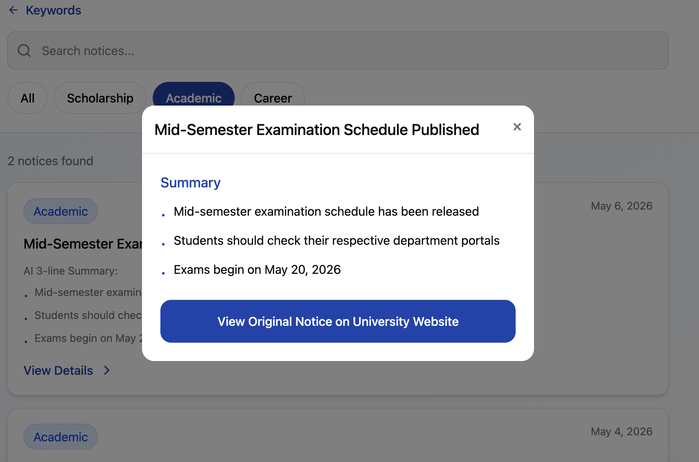
- **개요**: 요약본 확인 후 신청서 작성 등 실제 행정 처리를 위해 학교 홈페이지로 이동하는 화면이다.
- **상세 설계**:
    - 'View Website' 버튼을 강조 배치하여 외부 URL로의 안전한 리다이렉트를 지원한다.
- **분석적 의도**: 유스케이스 `UC-10(View full notice)`을 수행하며, 시스템이 단순히 정보를 전달하는 것에 그치지 않고 최종 과업까지 연결됨을 보여준다.

---

### 4.2 UI Design Rationale

1. **Efficiency of Curation**: 사용자가 공지사항 게시판을 일일이 확인하는 번거로움을 해결하기 위해, '설정-매칭-요약'의 3단계 로직이 UI에 직관적으로 녹아들도록 설계함.
2. **AI-Centric Interface**: 가장 핵심적인 가치인 'AI 요약'이 카드 중앙에 위치하도록 배치하여, 텍스트가 많은 공지사항의 가독성 문제를 기술적으로 해결함.
3. **Mobile-First Strategy**: 영남대학교 학생들의 주된 정보 소비 환경인 모바일 기기(iOS/Android)에 최적화된 반응형 레이아웃과 핑거 탭(Finger Tap) 친화적인 버튼 크기를 적용함.

## 5. Glossary

본 문서에서 사용된 주요 기술 용어 및 도메인 용어에 대한 정의는 다음과 같다.

| 용어 (Term) | 정의 (Definition) |
| :--- | :--- |
| **Curation (큐레이션)** | 대량의 정보 중 사용자의 목적에 맞는 콘텐츠를 선별하여 가치 있게 제공하는 행위. |
| **LLM (Large Language Model)** | 방대한 양의 텍스트 데이터를 학습하여 인간과 유사한 자연어를 생성하고 이해하는 인공지능 모델. |
| **Crawling (크롤링)** | 자동화된 방법으로 웹 페이지를 방문하여 필요한 데이터를 수집하는 기술. |
| **Pre-processing (전처리)** | 수집된 원시 데이터에서 노이즈(HTML 태그, 광고 등)를 제거하고 분석하기 쉬운 형태로 가공하는 과정. |
| **Multiplicity (다중도)** | 도메인 분석 시 객체 간의 관계를 수치로 표현한 것 (예: 1:N, N:M). |
| **Redirect (리다이렉트)** | 사용자가 특정 URL을 요청했을 때 다른 URL로 자동 연결하여 이동시키는 기술. |
| **Responsive Web (반응형 웹)** | 기기의 화면 크기(PC, 태블릿, 모바일)에 따라 레이아웃이 유동적으로 변하는 웹 디자인 방식. |

---

## 6. Reference

본 분석 보고서를 작성하기 위해 참고한 자료 및 도구는 다음과 같다.

1. **강의 자료**: 2026학년도 1학기 [운영체제/오픈소스 설계] 수업 강의안 및 과제 가이드라인.
2. **기술 문서**: 
    - Python BeautifulSoup/Selenium Library Docs (크롤링 로직 설계 참고).
3. **디자인 도구**: Figma (UI Prototype 제작 및 컴포넌트 설계).
4. **공식 사이트**: 영남대학교 홈페이지 공지사항 게시판 (데이터 구조 분석 및 URL 체계 확인).
5. **학술 자료**: 소프트웨어 공학의 유스케이스 분석 및 객체 지향 모델링 표준 가이드.
