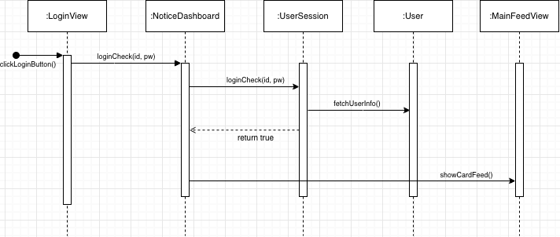
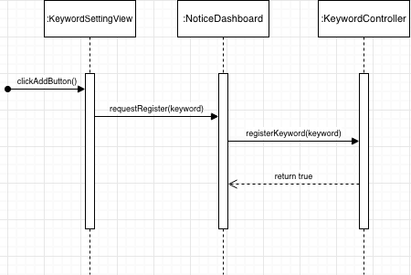
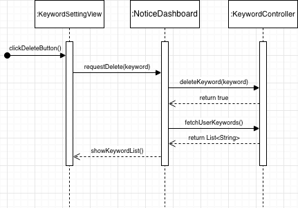
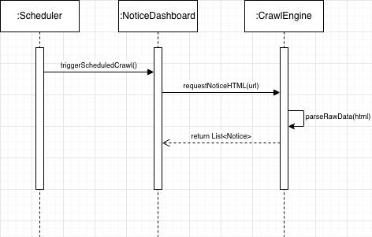
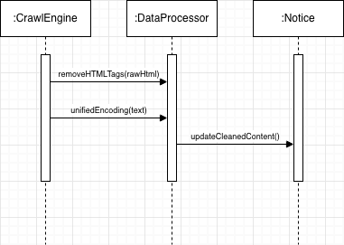
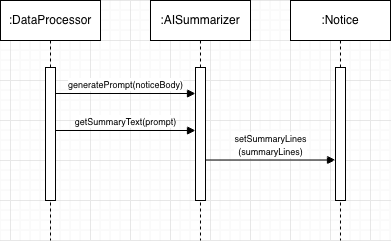
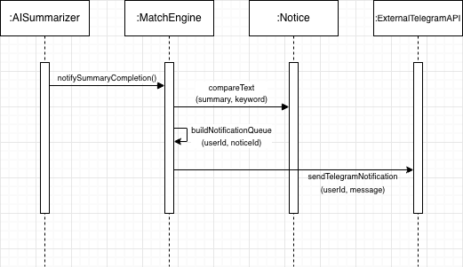
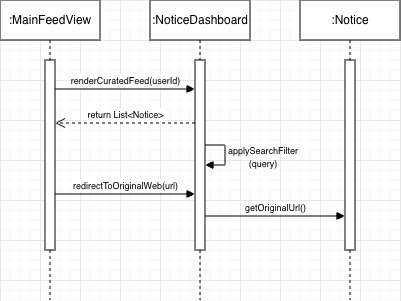
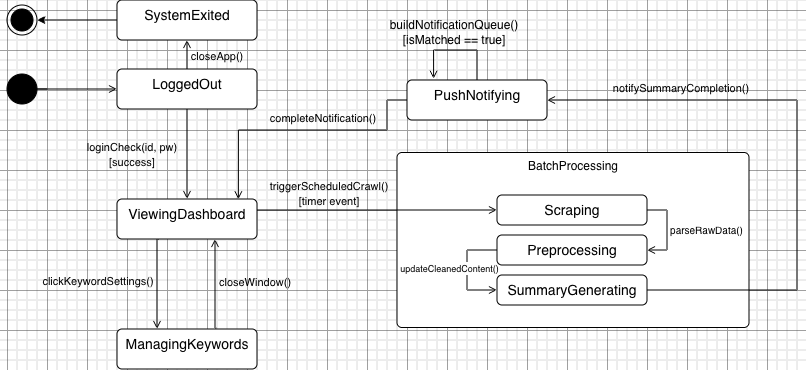

# 3. Design: 영남대 공지 AI 큐레이션 시스템 (Y-Curation)

**Student No:** 22420490  
**Name:** 김혜민  

**Project Name:** Y-Curation

**Log in/App Icon:**

---

### [ Revision history ]

| Revision date | Version # | Description | Author |
| :--- | :--- | :--- | :--- |
| 2026/06/02 | 1.00 | Design Phase 초안 작성 및 구조 설계 | 김혜민 |

---

### = Contents =
1. Introduction
2. Class diagram
3. Sequence diagram
4. State machine diagram
5. Implementation requirements
6. Glossary
7. References

---

## 1. Introduction

### 1.1 Summary
본 문서는 '영남대 공지 AI 큐레이션 시스템(Y-Curation)' 개발을 위한 세 번째 단계인 Design Phase의 결과물이다. 앞서 분석(Analysis) 단계에서 시스템이 '무엇을 해야 하는가(What to do)'에 집중하여 요구사항을 도출했다면, 본 설계 보고서에서는 이를 '어떻게 구체적인 소스코드로 구현할 것인가(How to implement)'에 대한 기술적 명세를 확정한다. 

본 시스템은 모바일 환경 및 백엔드 데이터 처리 엔진 간의 독립성을 보장하고 유지보수 효율을 극대화하기 위해 레이어드 아키텍처(Layered Architecture) 구조를 기본 채택한다. 본 문서에 명시되는 모든 클래스 구조, 시퀀스 상호작용 흐름, 상태 전이 도면은 실제 구현 시 소스코드 상에서의 용례와 100% 완벽히 일치함을 목적으로 설계되었다.

### 1.2 Important Points of Design
* **권한별 오퍼레이션 분리 (Authority Control)**: 학생(Student) 사용자가 접근하는 인터페이스와 시스템 백엔드(크롤러, AI 엔진)가 실행하는 코어 기능을 엄격히 격리하여 보안성과 독립성을 확보한다.
* **데이터 정보 공유의 제한 (Encapsulation)**: 클래스 간 무분별한 데이터 노출을 차단하기 위해 변수 제어자는 private을 원칙으로 하며, 외부 접근이 필요할 경우 제한적인 getter/setter 메커니즘을 사용해 객체지향 설계 원칙을 준수한다.

---

## 2. Class diagram

본 시스템의 정적 구조를 명시하기 위해 작성된 전체 클래스 다이어그램이다. 화면(UI) 레이어, 제어(Business Logic) 레이어, 데이터 엔티티(Entity) 레이어를 엄격히 격리하는 구조로 설계되었다.

### 2.1 Class Explanation Table
본 시스템을 구성하는 핵심 클래스들의 내부 멤버 변수(Attributes) 및 함수(Operations)의 상세 기술 명세이다. 실제 Java 프로젝트 구현 규격을 준수하여 설계되었다.

| 분류 | Class Name | Attributes (멤버 변수) | Operations (함수/메서드) & 설명 |
| :--- | :--- | :--- | :--- |
| **UI 화면** | **LoginView** | 없음 | `+ displayLoginWindow(): void` `+ clickLoginButton(): void` 사용자에게 학번과 비밀번호 입력 폼을 제공하고 로그인 이벤트를 캡처함. |
| **UI 화면** | **MainFeedView** | 없음 | `+ showCardFeed(): void` `+ clickNoticeCard(): void` AI 요약 공지사항들을 카드 레이아웃 형태로 화면에 출력하는 메인 UI 화면. |
| **UI 화면** | **KeywordSettingView** | 없음 | `+ showKeywordList(): void` `+ clickAddButton(): void` 사용자가 구독 중인 키워드 목록을 확인하고 추가/삭제하는 설정 화면. |
| **UI 화면** | **AdminPanelView** | 없음 | `+ showSystemStatus(): void` `+ clickForceCrawlButton(): void` 관리자가 크롤링 상태를 모니터링하고 수동 오퍼레이션을 명령하는 관리자 화면. |
| **제어/로직** | **UserSession** | `- studentId: String` `- password: String` `- loginStatus: boolean` `- userAuthority: int` | `+ loginCheck(id: String, pw: String): boolean` : 입력 인증 정보 검증 및 권한 분리. (UC-01) `+ logout(): void` : 현재 세션 만료 및 인증 상태 false 전환. |
| **제어/로직** | **KeywordController** | `- userId: String` `- currentKeywords: List<String>` | `+ registerKeyword(keyword: String): boolean` : 유효성 검사 후 새 관심 키워드 DB 추가. (UC-02) `+ deleteKeyword(keyword: String): boolean` : 등록된 키워드 DB 삭제 및 동기화. (UC-03) `+ fetchUserKeywords(): List<String>` : 현재 구독 중인 키워드 목록 반환. (UC-03) |
| **제어/로직** | **CrawlEngine** | `- targetUrl: String` `- lastCrawlTime: DateTime` | `+ requestNoticeHTML(url: String): String` : 영남대 공식 홈페이지 원시 HTML 요청. (UC-04) `+ parseRawData(html: String): List<Notice>` : HTML 구조 분해 후 순수 공지사항 리스트 추출. (UC-04) |
| **제어/로직** | **DataProcessor** | `- encodingType: String` | `+ removeHTMLTags(rawHtml: String): String` : 긁어온 본문 내 불필요한 태그 노이즈 정제. (UC-05) `+ unifiedEncoding(text: String): String` : UTF-8 인코딩 통일로 글자 깨짐 방지. (UC-05) |
| **제어/로직** | **AISummarizer** | `- apiKey: String` `- modelName: String` | `+ generatePrompt(noticeBody: String): String` : 3줄 요약 지시어 결합 프롬프트 생성. (UC-06) `+ getSummaryText(prompt: String): String[]` : 외부 LLM API 통신 후 3줄 요약 배열 리턴. (UC-06) |
| **제어/로직** | **MatchEngine** | `- activeQueueCount: int` | `+ compareText(summary: String[], keyword: String): boolean` : 요약문 내 사용자 관심 키워드 포함 대조. (UC-07) `+ buildNotificationQueue(userId: String, noticeId: int): void` : 매칭 성공 시 발송 대기 큐 DB 적재. (UC-08) |
| **제어/로직** | **NoticeDashboard** | `- displayList: List<Notice>` `- currentFilter: String` | `+ renderCuratedFeed(userId: String): void` : 카드 레이아웃 형태 정렬 및 화면 전송. (UC-09) `+ applySearchFilter(query: String): void` : 사용자 입력 검색어 매칭 피드 필터링. (UC-09) `+ redirectToOriginalWeb(url: String): void` : 외부 브라우저 호출 영남대 원문 리다이렉트. (UC-10) |
| **데이터 그릇** | **Notice** | `- noticeId: int` `- title: String` `- content: String` `- date: String` `- originalUrl: String` `- summaryLines: String[]` | 없음 시스템 내부에서 관리 및 가공되는 개별 공지사항 데이터 엔티티 클래스. |
| **데이터 그릇** | **User** | `- studentId: String` `- password: String` `- authorityCode: int` | 없음 시스템 데이터베이스에 저장된 고유 사용자 계정 정보 엔티티 클래스. |
---

## 3. Sequence diagram

본 장에서는 분석(Analysis) 단계에서 정의된 10개의 핵심 유스케이스(`UC-01` ~ `UC-10`)를 바탕으로, 시스템 내부 객체(Object)들이 시간 흐름에 따라 상호작용하는 동적 행위 명세를 명시한다. 각 시퀀스 다이어그램에 표현된 함수(Operation) 및 객체명은 `2. Class diagram`에 정의된 정적 명세와 100% 일치하도록 설계되었다.

### 3.1 sd Login (사용자 인증 및 로그인 시나리오)
사용자가 학번과 비밀번호를 입력하고 로그인 버튼을 클릭했을 때, 시스템 내부에서 세션을 검증하고 메인 대시보드 화면으로 전환되는 과정을 묘사한다. (`UC-01` 대응)

#### [ 정기 흐름 명세 (Normal Flow) ]
1. 사용자가 `LoginView` 인터페이스에서 로그인 버튼을 트리거하면 `clickLoginButton()` 자체 이벤트가 발생한다.
2. `LoginView` 객체는 사령탑인 `NoticeDashboard` 컨트롤러에게 사용자 입력 데이터를 전달하며 `loginCheck(id, pw)`를 호출한다.
3. `NoticeDashboard`는 세션 관리 모듈인 `UserSession`에게 인증 검증(`loginCheck`)을 위임한다.
4. `UserSession`은 `User` 데이터 그릇 엔티티를 참조하여 `fetchUserInfo()`를 수행하고 인증 결과를 확인한다.
5. 검증 완료 후 `UserSession`은 `NoticeDashboard`에게 결과값 `return true`를 점선으로 반환한다.
6. 성공 신호를 수신한 `NoticeDashboard`는 최종적으로 메인 화면인 `MainFeedView`를 호출하며 `showCardFeed()`를 실행해 화면을 전환한다.

---

### 3.2 sd Register Keyword (관심 키워드 등록 시나리오)
로그인된 사용자가 알림을 받기 위해 알림 설정 UI에서 새로운 관심 키워드를 입력하고 추가하는 흐름을 명시한다. (`UC-02` 대응)

#### [ 정기 흐름 명세 (Normal Flow) ]
1. 사용자가 `KeywordSettingView` 화면에서 키워드를 입력한 뒤 추가 버튼을 누르면 `clickAddButton()` 이벤트가 캡처된다.
2. `KeywordSettingView`는 사령탑인 `NoticeDashboard`에게 키워드 등록을 요청(`requestRegister(keyword)`)한다.
3. `NoticeDashboard`는 관심 키워드 제어 도메인인 `KeywordController`를 호출하여 `registerKeyword(keyword)` 로직을 수행시킨다.
4. `KeywordController`는 영구 데이터 저장소에 키워드 적재를 완료한 뒤, 사령탑에게 성공 결과인 `return true`를 반환하며 종료된다.

---

### 3.3 sd Manage Keyword (관심 키워드 삭제 및 목록 조회 시나리오)
사용자가 기존에 등록했던 키워드를 삭제하고, 삭제가 반영되어 최신화된 관심 키워드 목록을 화면에 다시 갱신하여 보여주는 복합 상호작용 흐름이다. (`UC-03` 대응)

#### [ 정기 흐름 명세 (Normal Flow) ]
1. 사용자가 `KeywordSettingView` 리스트에서 특정 키워드의 삭제 버튼을 클릭하면 `clickDeleteButton()`이 작동한다.
2. 화면은 `NoticeDashboard` 사령탑에 해당 키워드 삭제를 요청(`requestDelete(keyword)`)한다.
3. `NoticeDashboard`는 `KeywordController`에게 `deleteKeyword(keyword)` 명령을 전달하여 데이터를 삭제한다.
4. 데이터 삭제가 성공하면 `KeywordController`는 사령탑에게 `return true` 점선 신호를 보낸다.
5. `NoticeDashboard`는 화면 갱신을 위해 곧바로 `KeywordController`에게 최신 목록을 재요청(`fetchUserKeywords()`)한다.
6. `KeywordController`는 갱신된 최신 데이터인 `return List<String>`을 컨트롤러로 반환한다.
7. `NoticeDashboard`는 최종 수신한 목록 데이터를 `KeywordSettingView`로 넘겨주며 `showKeywordList()`를 호출해 UI를 실시간으로 새로고침한다.

---

### 3.4 sd Scrape Notice (원시 공지사항 크롤링 시나리오)
시스템 타이머 백엔드 모듈에 의해 주기적으로 영남대학교 공지사항 게시판 HTML 소스를 통째로 긁어오는 무인 배치 프로세스 흐름이다. (`UC-04` 대응)

#### [ 정기 흐름 명세 (Normal Flow) ]
1. 시스템 내부에 상주하는 `Scheduler` 타이머가 정해진 주기에 도달하면 `NoticeDashboard`를 깨우며 `triggerScheduledCrawl()`을 호출한다.
2. `NoticeDashboard`는 웹 크롤링 전담 모듈인 `CrawlEngine`에게 영남대 공지사항 타겟 주소를 주입하며 `requestNoticeHTML(url)`을 명령한다.
3. `CrawlEngine`은 네트워킹을 통해 가져온 원시 웹 소스를 파싱하기 위해 내부 자체 메서드인 `parseRawData(html)`를 호출하여 의미 있는 데이터 블록을 발라낸다.
4. 파싱 처리가 끝나면 `CrawlEngine`은 가공되지 않은 순수 공지사항 데이터 배열인 `return List<Notice>`를 사령탑에 전달하며 시퀀스를 종결한다.

---

### 3.5 sd Preprocess Text (텍스트 전처리 및 인코딩 시나리오)
크롤링된 원시 데이터에서 불필요한 스크립트나 태그 노이즈를 제거하고 한글 깨짐을 방지하기 위해 텍스트 정제 가공을 수행하는 백엔드 파이프라인 흐름이다. (`UC-05` 대응)

#### [ 정기 흐름 명세 (Normal Flow) ]
1. `CrawlEngine` 내부에서 원시 데이터 파싱이 시작되면 정제 전담 모듈인 `DataProcessor`를 찔러 `removeHTMLTags(rawHtml)`를 실행함으로써 정크 HTML 태그들을 청소한다.
2. 이어서 `CrawlEngine`은 글자 깨짐 현상을 방지하기 위해 `DataProcessor`에게 `unifiedEncoding(text)`을 호출하여 문자셋을 UTF-8 표준 포맷으로 통일한다.
3. 전처리와 인코딩 변환이 완료되면 `DataProcessor`는 최종 정제된 깔끔한 문자열 데이터를 데이터 그릇인 `Notice` 엔티티 객체 필드에 `updateCleanedContent()`를 호출하여 실시간으로 반영한다.

---

### 3.6 sd Generate AI Summary (AI 핵심 3줄 요약 생성 시나리오)
정제가 완료된 텍스트 본문을 외부 인공지능 API 인터페이스와 연동하여 핵심 3줄 요약본 배열을 추출하고 저장하는 파이프라인이다. (`UC-06` 대응)

#### [ 정기 흐름 명세 (Normal Flow) ]
1. 텍스트 정제가 끝난 `DataProcessor`는 AI 연동 모듈인 `AISummarizer`에게 공지 본문을 인자로 전달하며 요약용 지시문 프롬프트를 빌드하는 `generatePrompt(noticeBody)`를 호출한다.
2. 프롬프트 구조화가 완료되면 `DataProcessor`는 `AISummarizer`에게 실제 외부 LLM 인프라와 통신하여 3줄 요약 텍스트를 추출하도록 `getSummaryText(prompt)`를 호출한다.
3. `AISummarizer`는 외부 API 통신 결과로 정돈되어 나온 요약본 배열 데이터(`summaryLines`)를 받아내어, 데이터 엔티티 객체인 `Notice` 내부 필드에 `setSummaryLines(summaryLines)`를 실행해 최종 세팅한다.

---

### 3.7 sd Match Keyword and Notify (유저 키워드 매칭 및 발송 대기 시나리오)
AI가 추출한 3줄 요약 데이터와 사용자들이 설정한 관심 키워드를 전수 대조하고, 매칭에 성공하는 즉시 대기 큐에 적재함과 동시에 외부 텔레그램 인프라를 때려 스마트폰 알람을 발송하는 핵심 연동 흐름이다. (`UC-07`, `UC-08` 대응)

#### [ 정기 흐름 명세 (Normal Flow) ]
1. AI 요약 생성이 완료되면 `AISummarizer`는 키워드 대조 발송 엔진인 `MatchEngine`을 트리거하기 위해 `notifySummaryCompletion()`을 호출한다.
2. `MatchEngine`은 생성된 공지사항 데이터 객체 `Notice`에 접근하여, 요약 데이터와 사용자의 정규표현식 키워드가 일치하는지 판별하는 `compareText(summary, keyword)` 연산을 수행한다.
3. 키워드 매칭에 성공 조건이 성립되면 `MatchEngine`은 시스템 내부에 즉시 발송 레코드를 적재하기 위해 자체 메서드인 `buildNotificationQueue(userId, noticeId)`를 실행해 큐를 빌드한다.
4. 대기 큐 적재와 동시에 `MatchEngine`은 실제 연동된 외부 API 인프라인 `ExternalTelegramAPI`를 원격 호출하여 사용자 스마트폰으로 3줄 요약 알림을 전송하는 `sendTelegramNotification(userId, message)`을 처리하며 종료된다.

---

### 3.8 sd Dashboard Operations (큐레이션 피드 조회 및 링크 이동 시나리오)
사용자가 메인 대시보드 화면에 진입했을 때 데이터 렌더링, 검색창 필터링, 그리고 카드를 클릭했을 때 학교 원문 홈페이지 웹 브라우저로 리다이렉트되는 복합 UI 상호작용 흐름이다. (`UC-09`, `UC-10` 대응)

#### [ 정기 흐름 명세 (Normal Flow) ]
1. 사용자가 로그인 후 메인 대시보드 화면에 진입하면 `MainFeedView`는 사령탑인 `NoticeDashboard`에게 사용자 맞춤 피드 데이터를 요청하는 `renderCuratedFeed(userId)`를 호출한다.
2. `NoticeDashboard`는 내부 캐시 혹은 데이터셋에서 추출한 정렬된 공지 리스트인 `return List<Notice>` 데이터를 점선 화살표를 통해 화면으로 반환해 UI 카드들을 렌더링한다.
3. 사용자가 상단 검색창에 특정 단어를 타이핑하면 `NoticeDashboard`는 자체 필터링 메서드인 `applySearchFilter(query)`를 가동하여 실시간으로 화면의 공지 리스트를 가공한다.
4. 사용자가 특정 공지사항 카드를 마우스로 클릭하면 `MainFeedView`는 사령탑에게 학교 원문 웹사이트로의 이동을 요청하는 `redirectToOriginalWeb(url)`을 호출한다.
5. `NoticeDashboard`는 해당 공지사항 엔티티 객체인 `Notice`로 접근해 고유 하이퍼링크 주소를 Get 해오는 `getOriginalUrl()` 메서드를 최종적으로 수행하고 외부 브라우저 세션을 연다.

---

## 4. State machine diagram

본 장은 '영남대 공지 AI 큐레이션 시스템(Y-Curation)'의 전체 생명 주기(Life Cycle) 동안 발생하는 시스템 내부의 동적 상태 전이 과정을 명시한다. 특히 사용자 동작에 반응하는 프론트엔드 UI 레이어의 상태 전환과 백엔드에서 독립적으로 가동되는 데이터 수집 파이프라인의 연동 흐름을 명확히 정의하였다. 

단순한 상태 나열에 그치지 않고, 시스템 백엔드의 핵심 데이터 가공 엔진 영역을 복합 상태(Composite State) 구조로 계층화하여 설계함으로써 영남대 학부 설계 프로젝트 양식에 부합하는 구조적 무결성을 확보하였다.

### 4.1 상태 정의 명세 (State Specifications)
본 시스템 생명 주기를 제어하는 주요 상태들의 상세 정의 및 내부 역할은 다음과 같다.

* **LoggedOut**: 시스템이 구동된 후 최초로 마주하는 데스크톱 어플리케이션 인터페이스 상태이다. 사용자가 시스템 기능을 이용하기 전 단계로, 학번 및 인증 패스워드 정보를 입력받기 위한 사용자 입력을 대기하는 물리적 상태이다.
* **ViewingDashboard**: 사용자 로그인 인증이 최종 성공한 후 진입하는 메인 큐레이션 시스템 사령탑 상태이다. 백엔드 DB에서 가져온 AI 핵심 3줄 요약 공지사항 카드 리스트를 메인 피드 뷰에 안정적으로 렌더링하고, 사용자의 실시간 텍스트 검색 쿼리 입력 및 특정 공지 카드 클릭 이벤트를 대기한다.
* **ManagingKeywords**: 사용자가 알림 설정을 제어하기 위해 전용 모달 창을 팝업한 UI 컨텍스트 상태이다. 이 상태에서 사용자는 알림 유스케이스와 연동되어 자신만의 고유 키워드를 신규 등록하거나 기존 리스트를 조회하고 삭제하는 데이터 변동 연산을 수행할 수 있다.
* **BatchProcessing (Composite State)**: 평시 대기 상태 중, 내부 타이머 스케줄러 시스템에 의해 주기적으로 강제 트리거되어 무인으로 구동되는 백엔드 데이터 가공 파이프라인 복합 상태이다. 시스템의 처리 효율과 결합도를 시각화하기 위해 내부에 3가지 하위 서브 상태를 포함한다.
  * *Scraping*: 영남대학교 학부 게시판 공식 HTTP URL 주소로 커넥션을 생성하여 공지사항 본문이 포함된 원시 HTML 소스 코드를 바이트 스트림 형태로 수집 및 다운로드하는 하위 연산 상태이다.
  * *Preprocessing*: 수집된 원시 문자열 데이터 내에 포함된 불필요한 마크업 스크립트, 스타일시트 등 정크 태그 노이즈를 완벽히 제거하고 글자 깨짐 방지를 위해 캐릭터셋 문자열 인코딩을 UTF-8 표준 포맷으로 통일하는 하위 정제 상태이다.
  * *SummaryGenerating*: 정제 처리가 완료된 깨끗한 공지 본문을 가공하여 외부 인공지능 인프라 API 인터페이스에 프롬프트 형태로 전달한 뒤, 최종 핵심 3줄 요약 배열 데이터를 수신하여 Notice 객체 그릇에 바인딩하는 하위 인공지능 요약 상태이다.
* **PushNotifying**: AI 3줄 요약문 가공 연산이 끝난 직후 연속적으로 실행되는 푸시 발송 제어 상태이다. 새로 가공된 요약문 데이터와 전체 사용자들의 개별 구독 관심 키워드 풀을 정규표현식 기반으로 전수 대조 매칭을 시도한다.
* **SystemExited**: 로그인 대기 화면에서 사용자가 어플리케이션 종료 명령을 트리거했을 때, 시스템 백엔드 메모리에 상주하는 모든 스케줄러 루프, 네트워크 쓰레드, 데이터베이스 연결 세션을 안전하게 파괴하고 프로세스를 안전하게 릴리즈하는 최종 격리 상태이다.

### 4.2 전이 및 이벤트 명세 (Transition & Events)
다이어그램 내 객체 간의 동적 흐름을 제어하는 모든 전이 화살표와 이벤트 트리거, 조건절(Guard Condition)의 상세 동작 명세는 다음과 같다.

1. **Initial ➔ LoggedOut**
   * **이벤트**: 시스템 최초 구동 프로세스 트리거
   * **명세**: 실행 파일이나 메인 메서드가 실행되면 프로세스는 즉시 메모리를 할당받고 사용자 로그인 대기 화면을 띄우며 초기화 상태로 진입한다.
2. **LoggedOut ➔ ViewingDashboard**
   * **이벤트**: `loginCheck(id, pw) [success]`
   * **명세**: 사용자가 올바른 세션 계정 정보를 입력하고 로그인 버튼을 누르면, 인증 함수 검증 결과가 성공(`[success]`)함에 따라 메인 대시보드 피드 화면 상태로 전이한다.
3. **ViewingDashboard ➔ ManagingKeywords**
   * **이벤트**: `clickKeywordSettings()`
   * **명세**: 사용자가 메인 피드 화면 상단에 배치된 키워드 관리 아이콘을 클릭하면, 메인 화면 세션을 유지한 채 관심 키워드를 제어할 수 있는 설정 팝업 창 컨텍스트로 상태가 전이된다.
4. **ManagingKeywords ➔ ViewingDashboard**
   * **이벤트**: `closeWindow()`
   * **명세**: 관심 키워드의 추가, 조회, 삭제 제어 처리를 모두 마치고 설정 화면을 닫으면, 동기화된 키워드 데이터를 보존한 채 평시 대시보드 피드 조회 상태로 안전하게 복귀한다.
5. **ViewingDashboard ➔ BatchProcessing [Scraping]**
   * **이벤트**: `triggerScheduledCrawl() [timer event]`
   * **명세**: 대시보드 대기 상태 중 시스템 내부에 정의된 정기 배치 주기에 도달하여 타이머 백엔드 이벤트(`[timer event]`)가 발생하면, 시스템은 화면 제어와 독립적으로 구동되는 무인 공지사항 크롤링 하위 상태로 즉시 진입한다.
6. **Scraping ➔ Preprocessing**
   * **이벤트**: `parseRawData()`
   * **명세**: 대상 학부 게시판 웹 서버로부터 원시 HTML 데이터 다운로드가 완료되고, 원시 구조 분해 메서드(`parseRawData()`)가 호출되면 텍스트 노이즈 정제 및 인코딩 통일 하위 상태로 자동 전이한다.
7. **Preprocessing ➔ SummaryGenerating**
   * **이벤트**: `updateCleanedContent()`
   * **명세**: 정크 태그 청소와 UTF-8 인코딩 변환 작업이 모두 완료되어 깨끗한 본문 텍스트가 Notice 엔티티의 인스턴스 필드에 최종 갱신(`updateCleanedContent()`)되면, 3줄 요약을 추출하기 위한 외부 LLM API 통신 하위 상태로 전이한다.
8. **SummaryGenerating ➔ PushNotifying**
   * **이벤트**: `notifySummaryCompletion()`
   * **명세**: 인공지능 연동 모듈을 통해 모든 신규 공지사항의 핵심 3줄 요약 텍스트 바인딩이 최종 완료(`notifySummaryCompletion()`)되면 백엔드 복합 상태 블록을 즉시 탈출하여 키워드 매칭 및 발송 제어 상태로 넘어간다.
9. **PushNotifying ➔ PushNotifying (Self-Transition)**
   * **이벤트**: `buildNotificationQueue() [isMatched == true]`
   * **명세**: 요약문 데이터와 사용자 관심 키워드를 대조하는 과정에서 조건 절 매칭이 성립(`[isMatched == true]`)될 경우, 전송 대기 큐를 실시간으로 빌드하고 순차적 텔레그램 HttpClient 연격을 반복 가동하는 자체 전이 루프를 수행한다.
10. **PushNotifying ➔ ViewingDashboard**
    * **이벤트**: `completeNotification()`
    * **명세**: 전송 큐에 적재된 발송 대상 사용자들에 대한 실시간 스마트폰 텔레그램 푸시 알림 전송이 최종 완료(`completeNotification()`)되면, 시스템은 다시 평시 모니터링 및 실시간 검색 대기 상태인 메인 대시보드로 자원을 반납하며 복귀한다.
11. **LoggedOut ➔ SystemExited**
    * **이벤트**: `closeApp()`
    * **명세**: 로그인 대기 화면 컨텍스트에서 사용자가 우측 상단의 프로그램 닫기 버튼을 누르거나 종료 오퍼레이션(`closeApp()`)을 트리거하면 즉시 시스템 전면 종료 상태로 진입한다.
12. **SystemExited ➔ Final State**
    * **이벤트**: 없음 (즉시 전이)
    * **명세**: 프로세스 해제 상태에 도달하면 자바 가상머신(JVM)에 할당되었던 메모리 자원 파괴, 파일 입출력 스트림 종료, 백엔드 스케줄러 쓰레드 풀을 완전하게 정지시키며 시스템의 전체 생명 주기를 무결하게 종결(Final)한다.

---

## 5. Implementation requirements

본 장은 '영남대 공지 AI 큐레이션 시스템(Y-Curation)'을 실제 작동 가능한 소스 코드로 컴파일하고 안정적으로 구동하기 위해 충족되어야 하는 최소 및 권장 하드웨어 플랫폼 사양, 시스템 소프트웨어 환경, 그리고 아키텍처적 비기능 요구사항을 명시한다. 본 명세는 향후 시스템의 배포 및 유지보수 단계에서 인프라 구성의 기준점이 된다.

### 5.1 Hardware Requirements
본 시스템은 영남대 홈페이지로부터 대량의 웹 데이터를 수집하고, 데이터 전처리 및 인공지능 요약 연산을 동시다발적으로 수행해야 하므로 백엔드 쓰레드를 원활히 제어할 수 있는 하드웨어 사양이 요구된다.

| 항목 (Hardware Factor) | 최소 사양 (Minimum Specification) | 권장 사양 (Recommended Specification) |
| :--- | :--- | :--- |
| **CPU** | INTEL Core i3 또는 vCPU 2 Core 이상 | INTEL Core i5 / AMD Ryzen 5 또는 vCPU 4 Core 이상 |
| **RAM** | 4 GByte 이상 (기본 시스템 백엔드 구동용) | 8 GByte 이상 (다중 유저 매칭 및 데이터 캐싱용) |
| **Storage (SSD/HDD)** | 20 GByte 이상의 여유 공간 | 50 GByte 이상의 여유 공간 (누적 공지 데이터 적재) |
| **Network Infrastructure** | 상시 인터넷 연결 환경 (크롤링 수행 불가) | 초고속 광대역 인터넷 라인 (API 대기시간 최소화) |

### 5.2 Software Requirements
개발 언어의 런타임 환경과 UI 렌더링 프레임워크, 그리고 외부 연동 인프라의 정합성을 보장하기 위한 소프트웨어 스택 명세이다.

| 항목 (Software Factor) | 준수 규격 (Standard Version) | 역할 및 비고 (Purpose & Remark) |
| :--- | :--- | :--- |
| **Operating System** | Windows 10 이상 또는 Ubuntu 20.04 LTS 이상 | 멀티 플랫폼 실행 환경 보장 (크로스 컴파일 가능) |
| **Implementation Language** | Java OpenJDK 17 이상 | 가상 머신(JVM) 기반 백엔드 아키텍처 및 코어 구축 |
| **UI Framework** | Java Swing Framework | 데스크톱용 다중 창(Window) 및 카드 레이아웃 인터페이스 구현 |
| **Database Integration** | 로컬 텍스트 파일 (.txt / .json) 기반 정형 저장 | 무거운 RDBMS 설정을 배제하고 프로젝트 내 데이터 영속성 유지 |
| **External Interoperability** | Java HttpClient API, Telegram Bot API | 외부 고성능 인공지능 요약 API 및 스마트폰 푸시 서버 연동 |

### 5.3 Non-functional Requirements (비기능적 요구사항)
시스템의 안정성, 보안성, 유지보수성을 극대화하기 위해 설계 단계에서 반영된 구조적 요구사항 명세이다.

#### 1) 데이터 연속성 및 영속성 보장 (Data Persistence without Server)
* 본 시스템은 별도의 독립형 외부 데이터베이스 서버(MySQL, Oracle 등)를 두지 않는 경량화 아키텍처를 채택한다.
* 데이터베이스의 역할을 대체하기 위해 시스템 내부에 영속성 저장 구조를 가지는 텍스트 파일 세트(`.txt` 또는 `.json` 형식)를 프로젝트 데이터 루트 폴더 내에 유지한다.
* 각 파일은 사용자 계정 레코드(`User`), 관심 키워드 풀(`Keyword`), 가공 및 요약 완료된 공지사항 내역(`Notice`)을 정형화된 규격으로 보존하며, 시스템 시작 및 종료 시 `NoticeDashboard` 사령탑 제어 하에 입출력 스트림(I/O Stream)이 자동으로 동기화되도록 구현한다. 데이터 포맷이 오염되거나 수동 조작으로 인해 규격이 깨질 경우 예외 처리(Exception Handling) 레이어가 즉각 가동되도록 코드를 설계한다.

#### 2) 자원 관리 및 백엔드 스케줄러 안정성 (Concurrency & Resource Management)
* 정기적인 영남대 공지사항 웹 서버 크롤링 처리는 메인 UI 쓰레드(`MainFeedView`)의 멈춤(Freezing) 현상을 방지하기 위해, 백엔드에서 독립적으로 가동되는 멀티 쓰레드(Multi-threading) 타이머 스케줄러 구조를 엄격히 적용한다.
* 웹 요청 및 외부 인공지능 API 호출 시 발생할 수 있는 네트워크 대기 시간(Network Timeout) 문제를 차단하기 위해 모든 외부 커넥션 인터페이스에는 최대 10초의 제한 시간(Connection Timeout Limit)을 설정하여 시스템 전체가 대기 상태(Deadlock)에 빠지는 현상을 원천 차단한다.

#### 3) 보안성 및 객체 캡슐화 규칙 (Security & Encapsulation Strictness)
* 권한 제어자 명세에 따라 사용자 및 데이터 그릇 엔티티의 모든 내부 멤버 변수(Attributes)는 `private` 가시성을 필수적으로 강제한다.
* 변수에 대한 외부 클래스의 직접적인 메모리 참조 및 수동 변경을 완벽히 차단하고, 사전 정의된 제한적 `getter/setter` 통로만을 제공하여 객체지향 설계의 핵심 가치인 데이터 은닉화 및 무결성을 유지한다.

---

## 6. Glossary

본 장은 '영남대 공지 AI 큐레이션 시스템(Y-Curation)'의 설계 및 구현 문서 전반에 걸쳐 사용되는 핵심 기술 용어, 아키텍처 컴포넌트 명칭, 객체지향 설계 산출물의 도메인 용어 정의를 명시한다. 본 용어 정의를 통해 프로젝트 구성원 및 평가자 간의 기술적 개념 명세 불일치를 방지한다.

| 용어 (Terms) | 정의 및 설명 (Descriptions) |
| :--- | :--- |
| **Y-Curation** | 본 프로젝트의 공식 명칭으로, 영남대학교 학부 공지사항을 크롤링하여 AI로 요약한 뒤 정규표현식 기반으로 유저에게 맞춤형 알림을 제공하는 시스템 전체를 뜻함. |
| **Class Diagram** | 시스템의 정적 구조를 명시하기 위해 시스템 내부 클래스들의 존재와 이들 간의 구조적 관계(연관, 의존 등)를 도식으로 정의한 정적 설계 도면. |
| **Sequence Diagram** | 객체지향 시스템 설계에서, 유스케이스 시나리오를 바탕으로 시스템 내부 객체들이 시간 흐름에 따라 상호작용하는 동적 행위를 메시지 흐름으로 명시한 도면. |
| **State Machine Diagram** | 시스템 전체 또는 특정 코어 객체의 생명 주기(Life Cycle) 동안 발생할 수 있는 동적 상태 변화와 그 전이를 일으키는 트리거 이벤트를 묘사한 도면. |
| **NoticeDashboard** | 시스템의 정적 구조에서 중추 역할을 하는 Controller 클래스. UI 레이어(`Views`)와 백엔드 코어 모델 레이어 간의 데이터 흐름을 중계하고 제어하는 사령탑. |
| **CrawlEngine** | 영남대학교 웹 서버의 공식 공지사항 게시판 주소로 HTTP 커넥션을 생성하여 화면 원시 데이터(Raw HTML)를 바이트 스트림 형태로 수집 및 다운로드하는 백엔드 컴포넌트. |
| **DataProcessor** | 수집된 데이터 원본에서 HTML 정크 태그 노이즈를 청소하고, 문자열 캐릭터셋을 UTF-8 표준 포맷으로 통일하여 글자 깨짐을 원천 방지하는 전처리 전담 모듈. |
| **AISummarizer** | 외부 인공지능 인프라 API 인터페이스와 연동하여 정제된 공지사항의 본문 텍스트를 분석하고, 핵심 내용만 정형화된 3줄 요약 문장 배열로 가공해 내는 엔진. |
| **MatchEngine** | AI 요약본 문자열과 각 사용자가 등록한 정규표현식 기반 관심 키워드 풀을 전수 대조 매칭하고, 발송 대기 큐(`Notification Queue`)를 빌드하는 핵심 제어 모듈. |
| **UserSession** | 시스템 런타임 환경에서 현재 로그인 인증에 성공한 학생 사용자의 학번, 세션 유지 상태, 접근 권한 등 활성화된 보안 토큰 정보를 보존하고 제어하는 클래스. |
| **Notice Entity** | 고유 공지사항 ID, 제목, 전처리 본문, 작성 날짜, 원문 하이퍼링크 주소, AI 핵심 3줄 요약 배열 필드를 캡슐화하여 들고 있는 독립형 데이터 구조 그릇 객체. |
| **Encapsulation (캡슐화)** | 객체지향 설계 원칙 중 하나로, 객체의 내부 속성(Attributes)을 private으로 은닉하여 외부 클래스의 직접적인 메모리 침범을 차단하고 제한적 getter/setter로만 소통하는 기법. |
| **Composite State (복합 상태)** | 상태 머신 다이어그램에서 특정 상태 블록 내부가 다시 여러 개의 하위 서브 상태(Sub-states)들과 순차적 전이 흐름으로 계층화되어 이루어진 고차원 상태 구조. |
| **Self-Transition (자체 전이)** | 특정 상태에서 발생한 이벤트의 결과로 시스템이 외부의 다른 상태로 넘어가지 않고, 자기 자신 상태로 다시 꺾여 들어와 내부 오퍼레이션을 반복 수행하는 전이 형태. |
| **Telegram Bot API** | 시스템 내부 발송 엔진과 연동되어, 매칭 성공 조건이 충족된 공지사항 데이터를 사용자의 스마트폰으로 실시간 푸시(Push) 알림 메시지 형태로 가공하여 쏴주는 외부 인프라 통신 규격. |
| **Data Persistence (데이터 영속성)** | 프로그램이 종료되더라도 수집 및 가공된 유저, 키워드, 공지사항 레코드 데이터가 사라지지 않고 저장소(`.txt` 또는 `.json` 파일)에 안전하게 파일 입출력으로 보존되는 특성. |

---

## 7. References

본 장은 '영남대 공지 AI 큐레이션 시스템(Y-Curation)'의 정적 구조 설계 및 동적 상호작용 프로세스 모델링 과정에서 인용하고 참조한 소프트웨어 공학 표준 명세, 아키텍처 패턴 이론 가이드라인, 그리고 기술 구현 스택의 공식 개발자 문서 목록을 명시한다.

1. **Object Management Group (OMG)**
   * *Unified Modeling Language (UML) Specification, Version 2.5.1*
   * 💡 본 문서의 2장(Class Diagram), 3장(Sequence Diagram), 4장(State Machine Diagram) 표준 표기법 및 관계 선 정의 준수를 위한 핵심 규격 지침으로 참조함.
   * URL: https://www.omg.org/spec/UML/2.5.1/

2. **Oracle Corporation**
   * *Java Platform, Standard Edition (Java SE) 17 Language Specification & API Documentation*
   * 💡 클래스 정의 명세 테이블 내의 자료형(String, List, DateTime) 구조 정의 및 파일 입출력 스트림(I/O Stream) 설계의 기술적 구현 규격으로 인용함.
   * URL: https://docs.oracle.com/en/java/javase/17/

3. **Telegram Messenger Inc.**
   * *Telegram Bot API v7.0 - Core Communication Infrastructure Guide*
   * 💡 `MatchEngine` 및 `ExternalTelegramAPI` 연동 시 발생하는 푸시 알림 데이터 포맷, 메시지 적재 파라미터, 웹훅/HttpClient 통신 인터페이스 설계를 위해 참조함.
   * URL: https://core.telegram.org/bots/api
