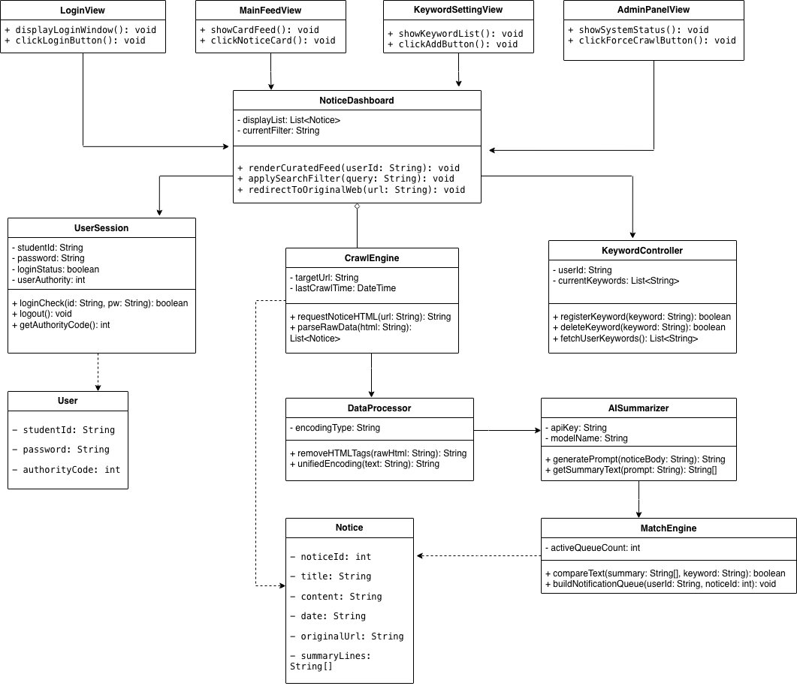

# 3. Design: 영남대 공지 AI 큐레이션 시스템 (Y-Curation)

**Student No:** 22420490  
**Name:** 김혜민  

**Project Name:** Y-Curation
**Log in/App Icon:**

---

### [ Revision history ]

| Revision date | Version # | Description | Author |
| :--- | :--- | :--- | :--- |
| 2026/06/02 | 1.00 | Design Phase 초안 작성 및 구조 설계 | 김혜민 |

---

### = Contents =
1. Introduction
2. Class diagram
3. Sequence diagram
4. State machine diagram
5. Implementation requirements
6. Glossary
7. References

---

## 1. Introduction

### 1.1 Summary
본 문서는 '영남대 공지 AI 큐레이션 시스템(Y-Curation)' 개발을 위한 세 번째 단계인 Design Phase의 결과물이다. 앞서 분석(Analysis) 단계에서 시스템이 '무엇을 해야 하는가(What to do)'에 집중하여 요구사항을 도출했다면, 본 설계 보고서에서는 이를 '어떻게 구체적인 소스코드로 구현할 것인가(How to implement)'에 대한 기술적 명세를 확정한다. 

본 시스템은 모바일 환경 및 백엔드 데이터 처리 엔진 간의 독립성을 보장하고 유지보수 효율을 극대화하기 위해 레이어드 아키텍처(Layered Architecture) 구조를 기본 채택한다. 본 문서에 명시되는 모든 클래스 구조, 시퀀스 상호작용 흐름, 상태 전이 도면은 실제 구현 시 소스코드 상에서의 용례와 100% 완벽히 일치함을 목적으로 설계되었다.

### 1.2 Important Points of Design
* **권한별 오퍼레이션 분리 (Authority Control)**: 학생(Student) 사용자가 접근하는 인터페이스와 시스템 백엔드(크롤러, AI 엔진)가 실행하는 코어 기능을 엄격히 격리하여 보안성과 독립성을 확보한다.
* **데이터 정보 공유의 제한 (Encapsulation)**: 클래스 간 무분별한 데이터 노출을 차단하기 위해 변수 제어자는 private을 원칙으로 하며, 외부 접근이 필요할 경우 제한적인 getter/setter 메커니즘을 사용해 객체지향 설계 원칙을 준수한다.

---

## 2. Class diagram

*(여기에 StarUML이나 Draw.io로 그릴 전체 Class Diagram 이미지가 들어갈 자리입니다)*

### 2.1 Class Explanation Table
본 시스템의 정적 구조를 구성하는 핵심 클래스들의 내부 멤버 변수(Attributes) 및 함수(Operations)의 상세 기술 명세이다. 본 명세는 Analysis 단계에서 정의된 유스케이스(UC-01 ~ UC-10)의 비즈니스 로직을 누락 없이 구현할 수 있도록 설계되었으며, 실제 소스코드의 데이터 타입과 100% 일치한다.

| Class Name | Attributes (멤버 변수) | Operations (함수/메서드) & 설명 |
| :--- | :--- | :--- |
| **UserSession** | `- studentId: String` `- password: String` `- loginStatus: boolean` `- userAuthority: int` | `+ loginCheck(id: String, pw: String): boolean` : 입력된 학번과 비밀번호를 검증하여 로그인 성공 여부를 반환함. **(UC-01 매핑)** `+ logout(): void` : 현재 세션을 만료시키고 로그인 상태를 false로 전환함. `+ getAuthorityCode(): int` : 계정의 권한 등급(학생: 1, 관리자: 9)을 반환함. |
| **KeywordController** | `- userId: String` `- currentKeywords: List<String>` | `+ registerKeyword(keyword: String): boolean` : 새로운 관심 키워드를 유효성 검사 후 데이터베이스에 추가함. **(UC-02 매핑)** `+ deleteKeyword(keyword: String): boolean` : 등록된 키워드 목록 중 사용자가 선택한 키워드를 삭제함. **(UC-03 매핑)** `+ fetchUserKeywords(): List<String>` : 현재 사용자가 구독 중인 모든 키워드 리스트를 반환함. **(UC-03 매핑)** |
| **CrawlEngine** | `- targetUrl: String` `- lastCrawlTime: DateTime` | `+ requestNoticeHTML(url: String): String` : 영남대학교 공식 홈페이지의 특정 게시판 원시 HTML 데이터를 요청함. **(UC-04 매핑)** `+ parseRawData(html: String): List<Notice>` : 수집된 HTML 데이터 내에서 순수 공지사항 게시물 리스트를 추출함. **(UC-04 매핑)** |
| **DataProcessor** | `- encodingType: String` | `+ removeHTMLTags(rawHtml: String): String` : 긁어온 공지 원문에서 불필요한 HTML 태그, 스크립트, 광고성 문자열을 정제함. **(UC-05 매핑)** `+ unifiedEncoding(text: String): String` : 텍스트 데이터의 인코딩 형식을 UTF-8로 통일하여 문자 깨짐을 방지함. **(UC-05 매핑)** |
| **AISummarizer** | `- apiKey: String` `- modelName: String` | `+ generatePrompt(noticeBody: String): String` : 정제된 공지사항 본문을 LLM API가 이해하기 쉬운 3줄 요약 양식 프롬프트로 변환함. **(UC-06 매핑)** `+ getSummaryText(prompt: String): String[]` : 외부 AI 서버와 통신하여 생성된 3줄 핵심 요약 결과 배열을 리턴받음. **(UC-06 매핑)** |
| **MatchEngine** | `- activeQueueCount: int` | `+ compareText(summary: String[], keyword: String): boolean` : 정규표현식을 기반으로 AI 요약문 내에 사용자의 관심 키워드가 포함되어 있는지 대조함. **(UC-07 매핑)** `+ buildNotificationQueue(userId: String, noticeId: int): void` : 키워드 매칭 성공 시, 해당 사용자에게 알림이 발송되도록 발송 대기 큐 레코드를 생성함. **(UC-08 매핑)** |
| **NoticeDashboard** | `- displayList: List<Notice>` `- currentFilter: String` | `+ renderCuratedFeed(userId: String): void` : 사용자의 키워드와 매칭된 요약 공지사항들을 메인 피드 화면에 카드 레이아웃 형태로 정렬하여 출력함. **(UC-09 매핑)** `+ applySearchFilter(query: String): void` : 사용자가 직접 입력한 검색어에 매칭되는 과거 공지 목록을 화면에 필터링하여 노출함. **(UC-09 매핑)** `+ redirectToOriginalWeb(url: String): void` : 사용자가 'View Website' 버튼을 클릭할 시 외부 브라우저를 통해 영남대 원문 주소로 리다이렉트함. **(UC-10 매핑)** |

---

## 3. Sequence diagram

본 장에서는 주요 유스케이스 시나리오를 바탕으로 시스템 내부 객체(Object)들이 시간 순서에 따라 어떻게 동적으로 메시지를 주고받는지 명시한다.

### 3.1 사용자 인증 및 진입 시나리오 (Interaction Log-in)
*(다이어그램 이미지 자리)*

### 3.2 관심 키워드 등록 및 검증 시나리오 (Interaction Register Keyword)
*(다이어그램 이미지 자리)*

### 3.3 공지 크롤링 및 AI 요약 파이프라인 (Interaction Batch Process)
*(다이어그램 이미지 자리)*

---

## 4. State machine diagram

본 장은 시스템 전체를 하나의 독립된 객체로 간주하고, 사용자 인터페이스 전환 및 백엔드 데이터 처리에 따른 전반적인 상태 전이 과정을 묘사한다.

*(다이어그램 이미지 자리)*

---

## 5. Implementation requirements

### 1) Hardware Requirements
* **CPU**: INTEL Core i3 또는 vCPU 2 Core 이상
* **RAM**: 4 GByte 이상
* **Storage**: SSD 20 GByte 이상의 여유 공간 (크롤링 데이터 및 요약본 축적용)

### 2) Software Requirements
* **Operating System**: Linux (Ubuntu 20.04 LTS 환경 권장) 또는 Windows 10 이상
* **Implementation Language**: Python 3.10+ 또는 Java JDK 17+

---

## 6. Glossary

*(추후 작성 예정)*

---

## 7. References

*(추후 작성 예정)*
