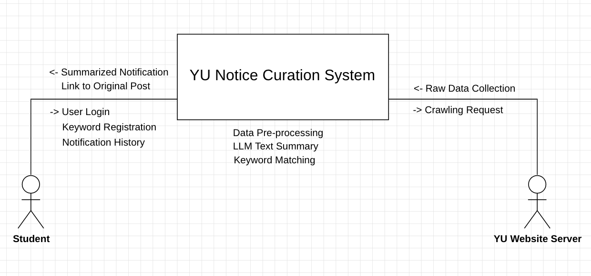

# YU-Notion-Curation

# 1. Conceptualization: 영남대 공지 AI 큐레이션 시스템

**학번:** 22420490  
**이름:** 김혜민  

---

### [ Revision history ]

| Revision date | Version # | Description | Author |
| :--- | :--- | :--- | :--- |
| 03/23/2026 | 0.00 | First draft and Project ideation | 김혜민 |
| 03/26/2026 | 0.01 | Business Purpose Supplement | 김혜민 |
| 03/26/2026 | 0.02 | Finalize Project Plan | 김혜민 |

---

### = Contents =
1. Business purpose
2. System context diagram
3. Use case list
4. Concept of operation
5. Problem statement
6. Glossary
7. References

---

## 1. Business purpose

### 1.1 Project Background & Motivation
- **정보 습득의 파편화 및 구조적 불편함:** 현재 영남대학교의 공지사항은 메인 홈페이지(일반, 학사, 장학 등)와 각 단과대별 홈페이지로 분산되어 운영된다. 학생들은 자신에게 필요한 정보를 얻기 위해 매일 2~3개 이상의 서로 다른 웹페이지를 수동으로 방문해야 하는 구조적 번거로움을 겪고 있다.
  
- **정보 획득의 시급성 및 기회비용 발생:** '대학생 청소년 교육지원 장학금(대청교)'과 같이 선착순이거나 신청 기간이 짧은 사업의 경우, 공지를 제때 확인하지 못해 혜택을 놓치는 사례가 빈번하다. 사용자가 정보를 직접 찾아야 하는 'Pull' 방식의 한계로 인해 발생하는 정보 불균형은 학생들의 학업 효율성을 저하시킨다.
  
- **텍스트 과부하 및 정보 파악의 어려움:** 공지사항 한 건당 포함된 정보량이 방대하여, 사용자가 본문을 직접 읽고 핵심 내용을 파악하는 데 상당한 시간이 소요된다. 특히 학내 용어와 시스템에 익숙하지 않은 신입생이나 전과생의 경우 이러한 정보 격차는 더욱 심화된다.
  
- **자동화 및 지능형 큐레이션의 필요성:** 위와 같은 문제를 해결하기 위해, 사용자가 설정한 키워드를 바탕으로 공지 데이터를 정기적으로 모니터링하고, 핵심 내용을 요약하여 실시간으로 전달하는 '지능형 알림 시스템' 구축이 필수적이다.

### 1.2 Goal
- 영남대 공지사항 게시판의 데이터를 정기적으로 파싱하는 안정적인 크롤러를 구축한다.
- 공지 본문에서 '대상', '기간', '제출 서류' 등 핵심 정보만 3줄 내외로 추출한다.
- 사용자가 등록한 관심 키워드가 포함된 공지만 필터링하여 실시간으로 전송하는 개인화 서비스 기능을 구현한다.
- SRUP 프로세스에 따라 분석과 설계 모델 간의 일관성을 유지하며 개발을 진행한다.

### 1.3 Target Market
- 공지 확인 시간을 단축하고 싶은 영남대학교 재학생 및 휴학생
- 장학금 등 주요 학사 일정을 놓치기 쉬운 정보 취약 계층 학생

---

## 2. System context diagram

### 2.1 Term Descriptions
- **YU Notice Curation System:** 본 프로젝트의 핵심 시스템으로, 공지 수집, AI 요약, 맞춤형 알림 기능을 제공한다.
- **Student (User):** 서비스를 이용하는 학생으로, 키워드를 등록하고 요약된 알림을 수신한다.
- **YU Website Server:** 영남대학교 공식 홈페이지 서버로, 시스템이 정보를 추출하는 원천 데이터 대상이다.

---

## 3. Use case list

| No. | Use Case Name | Actor | Description |
| :--- | :--- | :--- | :--- |
| 1 | **User Login** | Student | 사용자의 계정 정보를 인증하고 개인 설정을 불러온다. |
| 2 | **Keyword Registration** | Student | 알림을 받고 싶은 특정 키워드를 DB에 등록 및 수정한다. |
| 3 | **Crawling Request** | YU Server | 영남대 서버의 각 게시판(학사, 장학 등)에 데이터 수집을 요청한다. |
| 4 | **Raw Data Collection** | System | 서버로부터 받아온 HTML 원문 데이터를 시스템 내부로 가져온다. |
| 5 | **Data Pre-processing** | System | HTML 태그를 제거하고 공지사항의 순수 텍스트만 추출한다. |
| 6 | **LLM Text Summary** | System | 추출된 텍스트를 AI 모델(LLM)을 통해 3줄 핵심 요약으로 변환한다. |
| 7 | **Keyword Matching** | System | 요약된 내용과 사용자가 등록한 키워드의 일치 여부를 판별한다. |
| 8 | **Summarized Notification** | Student | 매칭된 공지 요약본을 사용자의 기기로 실시간 전송한다. |
| 9 | **Link to Original Post** | Student | 요약본 하단의 링크를 클릭 시 원문 게시글 페이지로 연결한다. |
| 10 | **Notification History** | Student | 과거에 수신한 알림 리스트를 사용자가 다시 확인할 수 있게 관리한다. |

---

## 4. Concept of operation

| Use Case Name | Purpose | Approach | Dynamics | Goals |
| :--- | :--- | :--- | :--- | :--- |
| **User Login** | 사용자 식별 및 보안 강화 | ID/PW 인증 절차 수행 | 로그인 성공 시 개인 설정값 로드 | 사용자 맞춤형 데이터 접근 권한 확보 |
| **Keyword Registration** | 개인별 맞춤 정보 필터링 | 설정 화면에서 관심 키워드 입력 | 입력된 키워드를 실시간으로 DB 저장 | 사용자 관심사에 최적화된 정보 선별 |
| **Crawling Request** | 최신 공지 데이터 확보 | Java JSoup 라이브러리 활용 | 스케줄러를 통해 주기적으로 서버 요청 | 정보 업데이트의 실시간성 유지 |
| **Raw Data Collection** | 외부 서버 데이터의 내부화 | YU 서버 응답으로부터 HTML 수집 | 수집 데이터를 시스템 내부 버퍼에 저장 | 데이터 분석을 위한 기초 자원 확보 |
| **Data Pre-processing** | 텍스트 분석 효율화 | HTML 태그 및 광고성 문구 제거 | 원문 수집 직후 자동 정제 엔진 가동 | 분석에 적합한 순수 텍스트 생성 |
| **LLM Text Summary** | 정보 파악 시간 단축 | OpenAI API(GPT-4 등) 연동 | 정제된 텍스트를 AI 모델에 전달 | 핵심 정보의 시인성 극대화 |
| **Keyword Matching** | 알림 대상의 정확한 선별 | 키워드 리스트와 요약본 텍스트 대조 | 요약 완료 시 키워드 포함 여부 판별 | 불필요한 스팸성 알림 방지 |
| **Summarized Notification** | 실시간 정보 전달 | 텔레그램 봇 또는 앱 푸시 발송 | 매칭 성공 즉시 사용자 기기로 전송 | 공지 확인 누락 방지 및 신속 대응 |
| **Link to Original Post** | 정보의 신뢰성 확보 | 요약본 하단에 게시글 URL 삽입 | 알림 클릭 시 원문 페이지로 연결 | 요약 정보의 사실 관계 확인 편의성 |
| **Notification History** | 과거 알림 정보의 재확인 | 수신 알림 데이터를 히스토리 DB 저장 | 보관함 메뉴 클릭 시 저장 목록 호출 | 정보의 연속성 및 사후 확인 보장 |

---

## 5. Problem statement

본 시스템은 분산된 공지사항을 실시간으로 수집하고 요약하여 전달하는 과정에서 다음과 같은 기술적 문제들에 직면할 수 있으며, 이를 해결하는 것을 목적으로 한다. 

### 1) Problem #1 Data Consistency (데이터 일관성 및 정제)
- **문제:** 영남대 홈페이지의 각 게시판마다 HTML 태그 구조가 다르기 때문에, 크롤링 시 제목, 날짜, 본문 데이터를 일관되게 추출하기 어렵다.
- **해결:** 게시판별 맞춤형 파싱 알고리즘을 적용하고, 데이터 전처리(Pre-processing) 단계를 거쳐 규격화된 데이터 프로토콜을 생성하여 관리한다.

### 2) Problem #2 Real-time Data Processing (실시간 통신 및 처리)
- **문제:** 다수의 사용자가 동시에 키워드 알림을 기다리는 상황에서, 서버가 수집-요약-발송 과정을 지연 없이 처리해야 하는 실시간성 확보가 필수적이다.
- **해결:** 데이터 수집 및 AI 요약 처리를 독립적인 쓰레드(Thread)로 배정하여 병렬로 처리함으로써, 사용자에게 1:1로 실시간 알림을 보내는 것과 같은 신속성을 확보한다.

### 3) Problem #3 Information Accuracy (요약 정보의 정확성)
- **문제:** LLM(대규모 언어 모델)이 본문을 요약하는 과정에서 날짜나 신청 링크 등 핵심 수치를 잘못 생성하는 환각(Hallucination) 현상이 발생할 수 있다.
- **해결:** 요약본 하단에 항상 원본 게시글 링크(Original Link)를 강제로 포함하여 사용자가 최종적으로 팩트 체크를 할 수 있는 검증 체계를 마련한다.

---

## 6. Glossary

- **Crawling (크롤링):** 웹 페이지(YU Server)의 데이터를 소프트웨어를 통해 자동으로 수집하는 기술.
- **Parsing (파싱):** 수집된 HTML 데이터에서 필요한 정보(제목, 날짜, 본문 등)를 추출하여 의미 있는 데이터로 변환하는 과정.
- **Data Pre-processing (전처리):** 수집된 원문 데이터에서 불필요한 태그 및 특수문자를 제거하여 분석 효율을 높이는 가공 단계.
- **LLM (Large Language Model):** 대규모 언어 모델로, 본 시스템에서는 OpenAI API 등을 통해 공지 본문의 핵심 내용을 3줄로 요약하는 데 사용됨.
- **Hallucination (환각 현상):** AI가 요약 과정에서 사실과 다른 수치나 정보를 생성하는 오류 현상.
- **Keyword Matching:** 사용자가 설정한 관심 키워드와 요약된 텍스트의 일치 여부를 판별하는 알고리즘.
- **Push Notification (푸시 알림):** 시스템이 사용자에게 새로운 정보를 실시간으로 즉시 전송하는 통신 방식.
- **Thread (쓰레드):** 시스템 내에서 독립적으로 실행되는 작업 단위로, 데이터 수집과 요약 처리를 병렬로 수행하기 위해 사용됨.
- **Curation (큐레이션):** 방대한 정보 중 사용자의 목적에 맞는 가치 있는 정보만 선별하여 가공 및 제공하는 서비스.

---

## 7. Reference

- **영남대학교 공식 홈페이지:** [https://www.yu.ac.kr](https://www.yu.ac.kr) (학사/장학 공지사항 데이터 원천)
- **JSoup Documentation:** [https://jsoup.org/](https://jsoup.org/) (Java 기반 웹 크롤링 및 HTML 파싱 라이브러리)
- **OpenAI API Guide:** [https://platform.openai.com/docs/](https://platform.openai.com/docs/) (LLM 기반 텍스트 요약 및 데이터 처리 기술)
- **Telegram Bot API:** [https://core.telegram.org/bots/api](https://core.telegram.org/bots/api) (실시간 푸시 알림 인터페이스 구축)
- **StarUML Guide:** [https://docs.staruml.io/](https://docs.staruml.io/) (System Context Diagram 및 소프트웨어 설계 도구)
